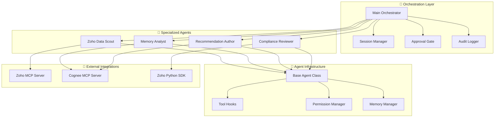

# 🤖 Agent Architecture

<div align="center">


**Intelligent Multi-Agent Orchestration System**

</div>

---

## 🎯 Overview

The Agent Architecture defines a sophisticated multi-agent system built on Claude Agent SDK (Python 3.14) that orchestrates specialized AI agents to automate account management workflows. Each agent has specific capabilities, tool permissions, and responsibilities, working together through a central orchestrator to deliver comprehensive account insights and recommendations.

### ✨ Key Features

- **🧠 Multi-Agent Coordination**: Orchestrator manages specialized subagents
- **🛡️ Security-First Design**: Least-privilege tool access with audit trails
- **🔄 Human-in-the-Loop**: All CRM modifications require explicit approval
- **📊 Contextual Memory**: Cross-session memory retention via Cognee
- **⚡ High Performance**: Sub-30 second account analysis with parallel processing

---

## 🏗️ Architecture

<div align="center">



</div>

---

## 🤖 Agent Specifications

### 🎯 Main Orchestrator

**Purpose**: Central coordination hub for all agent operations

**Capabilities**:
- Workflow scheduling and execution
- Subagent delegation and coordination
- Human approval gate management
- Session lifecycle management
- Audit trail generation

**Tools & Permissions**:
```yaml
permission_mode: default
allowed_tools:
  - SubagentCall
  - Read (config files only)
  - SessionManager
  - ApprovalGate
denied_tools:
  - Write (to CRM)
  - Bash
  - WebFetch
mcp_servers: none
```

**Example Usage**:
```python
from src.orchestrator.main import AccountOrchestrator

orchestrator = AccountOrchestrator()

# Analyze account with full workflow
result = await orchestrator.analyze_account("ACC-12345")
print(f"Health Score: {result.health_score}")
print(f"Recommendations: {len(result.recommendations)}")
```

### 🔍 Zoho Data Scout

**Purpose**: Account data retrieval and change detection

**Capabilities**:
- Account information gathering
- Change detection and monitoring
- Owner mapping and assignment
- Activity timeline analysis
- Deal stage tracking

**Tools & Permissions**:
```yaml
permission_mode: default
allowed_tools:
  - Read (local cache)
mcp_servers:
  - zoho-crm (read-only tools)
allowed_mcp_tools:
  - search_accounts
  - get_account_details
  - list_deals
  - get_user_info
denied_mcp_tools:
  - update_account
  - create_deal
  - delete_*
```

**Example Usage**:
```python
from src.agents.zoho_scout import ZohoDataScout

scout = ZohoDataScout()

# Retrieve account data
account_data = await scout.get_account_data("ACC-12345")

# Detect changes
changes = await scout.detect_changes("ACC-12345", since="2024-01-01")

# Get activity timeline
timeline = await scout.get_activity_timeline("ACC-12345")
```

### 🧠 Memory Analyst

**Purpose**: Historical context analysis and pattern recognition

**Capabilities**:
- Historical data synthesis
- Pattern analysis and trend detection
- Relationship mapping
- Contextual insights generation
- Similar account identification

**Tools & Permissions**:
```yaml
permission_mode: default
allowed_tools:
  - Read
mcp_servers:
  - cognee-memory (read-only)
allowed_mcp_tools:
  - search_context
  - get_account_timeline
  - retrieve_similar_accounts
denied_mcp_tools:
  - add_context (write operations)
  - delete_context
```

**Example Usage**:
```python
from src.agents.memory_analyst import MemoryAnalyst

analyst = MemoryAnalyst()

# Analyze historical patterns
patterns = await analyst.analyze_patterns("ACC-12345")

# Find similar accounts
similar = await analyst.find_similar_accounts("ACC-12345")

# Generate contextual insights
insights = await analyst.generate_insights("ACC-12345")
```

### 💡 Recommendation Author

**Purpose**: Actionable recommendation generation

**Capabilities**:
- Recommendation synthesis
- Confidence scoring
- Action template generation
- Priority ranking
- Rationale development

**Tools & Permissions**:
```yaml
permission_mode: default
allowed_tools:
  - Write (local draft files in /tmp/recommendations/)
mcp_servers: none
denied_mcp_tools:
  - All Zoho CRM write operations
```

**Example Usage**:
```python
from src.agents.recommendation_author import RecommendationAuthor

author = RecommendationAuthor()

# Generate recommendations
recommendations = await author.generate_recommendations(
    account_id="ACC-12345",
    context=analysis_context
)

# Score confidence
confidence = await author.score_confidence(recommendation)

# Create action templates
templates = await author.create_action_templates(recommendations)
```

### 🛡️ Compliance Reviewer

**Purpose**: Policy validation and data privacy enforcement

**Capabilities**:
- PII detection and sanitization
- Policy rule validation
- Compliance scoring
- Data privacy enforcement
- Audit trail verification

**Tools & Permissions**:
```yaml
permission_mode: default
allowed_tools:
  - Read
  - Write (redacted output files)
mcp_servers: none
```

**Example Usage**:
```python
from src.agents.compliance_reviewer import ComplianceReviewer

reviewer = ComplianceReviewer()

# Review for PII
pii_check = await reviewer.check_pii(data)

# Validate compliance
compliance = await reviewer.validate_compliance(action)

# Sanitize output
sanitized = await reviewer.sanitize_output(output)
```

---

## 🔧 Agent Infrastructure

### Base Agent Class

```python
from claude_agent_sdk import ClaudeSDKClient, ClaudeAgentOptions
from typing import AsyncGenerator, Optional, Dict, Any, List

class BaseAgent:
    """Base class for all agents using Claude SDK."""
    
    def __init__(
        self,
        agent_id: str,
        system_prompt: str,
        allowed_tools: List[str],
        mcp_servers: Optional[Dict[str, Any]] = None,
        permission_mode: str = "default",
    ):
        self.agent_id = agent_id
        self.logger = logger.bind(agent_id=agent_id)
        
        # Configure agent options
        self.options = ClaudeAgentOptions(
            api_key=settings.anthropic.api_key,
            model=settings.anthropic.model,
            system_prompt=system_prompt,
            allowed_tools=allowed_tools,
            permission_mode=permission_mode,
            mcp_servers=mcp_servers or {},
            hooks={
                "pre_tool": audit_hook.pre_tool,
                "post_tool": audit_hook.post_tool,
                "on_session_start": metrics_hook.on_session_start,
                "on_session_end": metrics_hook.on_session_end,
                "can_use_tool": permission_hook.can_use_tool,
            },
            max_iterations=settings.agent.max_iterations,
            timeout=settings.agent.timeout_seconds,
        )
        
        # Initialize SDK client
        self.client = ClaudeSDKClient(self.options)
        self.session_id: Optional[str] = None
    
    async def execute(
        self,
        task: str,
        context: Optional[Dict[str, Any]] = None,
    ) -> AsyncGenerator[str, None]:
        """Execute agent task with streaming responses."""
        self.logger.info("agent_execution_started", task=task)
        
        try:
            # Format prompt with context
            prompt = self._format_prompt(task, context)
            
            # Stream responses
            async for chunk in self.client.query(prompt):
                if chunk.get("type") == "text":
                    yield chunk.get("content", "")
                elif chunk.get("type") == "session_id":
                    self.session_id = chunk.get("session_id")
            
            self.logger.info("agent_execution_completed", session_id=self.session_id)
            
        except Exception as e:
            self.logger.error("agent_execution_failed", error=str(e))
            raise
```

### Tool Hooks System

```python
class AuditHook:
    """Comprehensive audit logging for all agent actions."""
    
    async def pre_tool(
        self,
        tool_name: str,
        tool_input: Dict[str, Any],
        context: Dict[str, Any],
    ) -> None:
        """Log tool execution before it runs."""
        logger.info(
            "tool_execution_started",
            tool_name=tool_name,
            tool_input=tool_input,
            agent_id=context.get("agent_id"),
            session_id=context.get("session_id"),
        )
    
    async def post_tool(
        self,
        tool_name: str,
        tool_input: Dict[str, Any],
        tool_output: Any,
        context: Dict[str, Any],
        error: Optional[Exception] = None,
    ) -> None:
        """Log tool execution after completion."""
        status = "failed" if error else "completed"
        logger.info(
            "tool_execution_completed",
            tool_name=tool_name,
            status=status,
            error=str(error) if error else None,
        )
```

### Permission Management

```python
class PermissionHook:
    """Enforce tool permissions and security policies."""
    
    def can_use_tool(
        self,
        tool_name: str,
        tool_input: Dict[str, Any],
        context: Dict[str, Any],
    ) -> bool:
        """Determine if agent can use specific tool with given input."""
        agent_id = context.get("agent_id")
        
        # Check if agent has permission for this tool
        agent_permissions = self.permissions.get(agent_id, {})
        if tool_name not in agent_permissions.get("allowed_tools", []):
            logger.warning(
                "tool_permission_denied",
                agent_id=agent_id,
                tool_name=tool_name,
                reason="tool_not_allowed",
            )
            return False
        
        # Check tool-specific constraints
        constraints = agent_permissions.get("constraints", {}).get(tool_name, {})
        
        # Example: File path restrictions
        if tool_name in ["read", "write", "edit"]:
            file_path = tool_input.get("file_path", "")
            allowed_paths = constraints.get("allowed_paths", [])
            
            if allowed_paths and not any(
                file_path.startswith(path) for path in allowed_paths
            ):
                logger.warning(
                    "tool_permission_denied",
                    agent_id=agent_id,
                    tool_name=tool_name,
                    file_path=file_path,
                    reason="path_not_allowed",
                )
                return False
        
        return True
```

---

## 🔄 Agent Coordination

### Workflow Orchestration

```python
class AccountOrchestrator:
    """Main orchestrator for account analysis workflows."""
    
    async def analyze_account(self, account_id: str) -> AccountAnalysis:
        """Execute complete account analysis workflow."""
        
        # Step 1: Data Collection
        scout_result = await self.zoho_scout.get_account_data(account_id)
        
        # Step 2: Historical Analysis
        memory_result = await self.memory_analyst.analyze_patterns(
            account_id, scout_result
        )
        
        # Step 3: Recommendation Generation
        recommendations = await self.recommendation_author.generate_recommendations(
            account_id, scout_result, memory_result
        )
        
        # Step 4: Compliance Review
        reviewed_recommendations = await self.compliance_reviewer.review_recommendations(
            recommendations
        )
        
        # Step 5: Approval Gate
        if reviewed_recommendations.requires_approval:
            await self.approval_gate.request_approval(reviewed_recommendations)
        
        return AccountAnalysis(
            account_id=account_id,
            health_score=scout_result.health_score,
            recommendations=reviewed_recommendations,
            analysis_timestamp=datetime.utcnow()
        )
```

### Session Management

```python
class SessionManager:
    """Manages agent session lifecycle and context."""
    
    async def create_session(self, account_id: str) -> str:
        """Create new analysis session."""
        session_id = str(uuid4())
        
        await self.memory_manager.store_session_context(
            session_id, {"account_id": account_id}
        )
        
        return session_id
    
    async def continue_session(self, session_id: str, additional_context: Dict[str, Any]):
        """Continue existing session with additional context."""
        existing_context = await self.memory_manager.get_session_context(session_id)
        
        merged_context = {**existing_context, **additional_context}
        await self.memory_manager.update_session_context(session_id, merged_context)
```

---

## 📊 Performance & Monitoring

### Key Metrics

| Metric | Target | Description |
|--------|--------|-------------|
| **Agent Response Time** | <30 seconds | Time for complete account analysis |
| **Tool Call Latency** | <2 seconds | Average tool execution time |
| **Session Success Rate** | 95% | Successful session completion rate |
| **Memory Usage** | <100MB/agent | Memory consumption per agent |

### Monitoring Dashboard

Access agent metrics at: `http://localhost:9090/metrics`

Key metrics include:
- Agent session count and duration
- Tool call frequency and latency
- Error rates by agent and tool
- Memory usage per agent
- Approval gate statistics

---

## 🛠️ Development

### Running Tests

```bash
# Unit tests
pytest tests/unit/test_agents.py -v

# Integration tests
pytest tests/integration/test_agent_workflows.py -v

# Performance tests
pytest tests/performance/test_agent_performance.py -v
```

### Local Development

```bash
# Start agent development environment
python src/agents/dev_server.py --port 8080

# Test individual agents
python -m pytest tests/unit/test_zoho_scout.py -v

# Monitor agent logs
tail -f logs/agents.log
```

---

## 📚 Documentation

- **[Agent Specifications](sparc/04_agent_specifications.md)** - Detailed agent specifications
- **[Architecture Design](sparc/03_architecture.md)** - Complete system architecture
- **[Implementation Plan](implementation_plan.md)** - Development roadmap
- **[Testing Strategy](testing_strategy.md)** - Testing approach and guidelines

---

## 🔗 Related Documentation

- [Main README](../../README.md) - Project overview
- [Zoho Integration](integrations/README.md) - CRM integration guide
- [Cognee Integration](memory/README.md) - Memory system integration
- [Security Guide](security.md) - Security and compliance

---

<div align="center">

**Part of the Sergas Super Account Manager System**

[← Back to Main README](../../README.md) • [Zoho Integration →](integrations/README.md)

</div>
