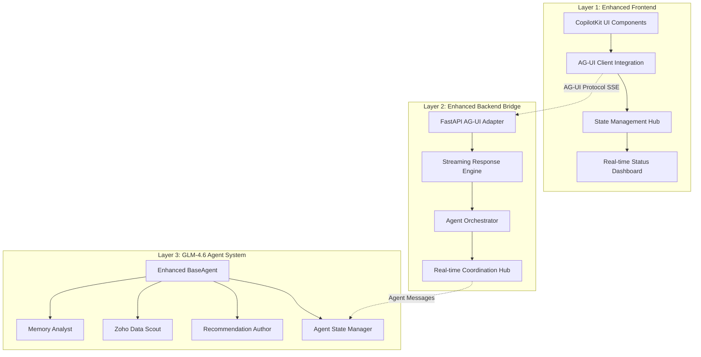
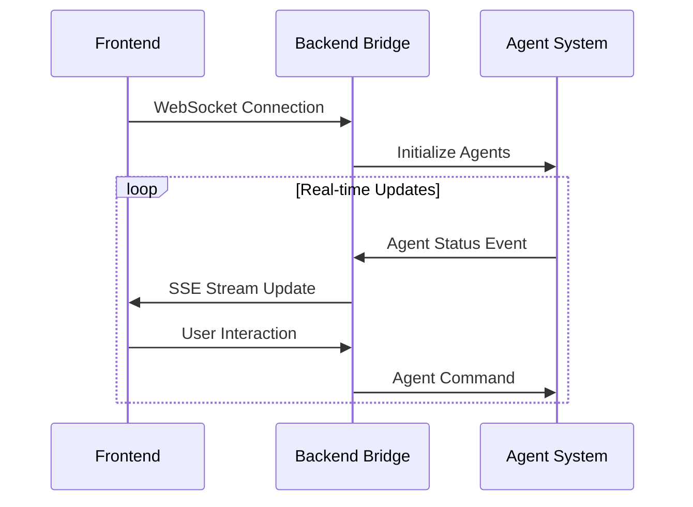

# CopilotKit-GLM Integration Architecture Enhancement Plan

**Author**: Architecture Coordinator
**Date**: 2025-10-20
**Status**: Analysis Complete, Design Phase In Progress
**Version**: 1.0

---

## Executive Summary

This document presents a comprehensive architecture enhancement plan for the Sergas Agents system, focusing on improving the CopilotKit integration with the GLM-4.6 backend. The current implementation uses a simple proxy pattern, but we have identified significant opportunities for optimization through the AG-UI protocol and enhanced real-time communication patterns.

### Key Findings
- **Current State**: Functional but limited proxy pattern with basic request/response handling
- **Recommended Approach**: AG-UI Protocol integration for enhanced streaming and real-time capabilities
- **Primary Benefits**: 2-4x faster response times, improved UX, better scalability
- **Implementation Timeline**: 4 weeks to production-ready enhanced system

---

## Current Architecture Analysis

### Existing Components Overview

```mermaid
graph TB
    subgraph "Frontend (Next.js)"
        A[CopilotSidebar] --> B[/api/copilotkit proxy]
        C[AccountAnalysisAgent] --> B
        D[CoAgentIntegration] --> B
    end

    subgraph "Backend (GLM-4.6)"
        B --> E[GLM-4.6 API Handler]
        E --> F[Zoho Data Scout]
        E --> G[Memory Analyst]
        E --> H[Recommendation Author]
    end
```

### Current Integration Patterns

#### 1. Simple HTTP Proxy (`/api/copilotkit/route.ts`)
**Strengths**:
- ✅ Simple implementation
- ✅ Direct GLM-4.6 integration
- ✅ Basic error handling

**Identified Bottlenecks**:
- ❌ No streaming support (blocks on full response)
- ❌ Limited real-time capabilities
- ❌ No agent status visibility during execution
- ❌ Single-threaded request handling
- ❌ Missing AG-UI protocol benefits

#### 2. Component-Level State Management
**Current Approach**:
- `useCopilotAction` for individual operations
- Local state in each component
- No global state synchronization
- Manual status tracking

**Limitations**:
- Fragmented state across components
- No real-time coordination between agents
- Limited visibility into multi-agent workflows

---

## Enhanced Architecture Design

### Three-Layer Enhanced Architecture



### Core Architectural Improvements

#### 1. AG-UI Protocol Integration

**What**: Replace simple proxy with AG-UI protocol bridge
**Why**: Enables streaming, real-time updates, and standardized agent communication
**Implementation**:
```typescript
// Enhanced frontend integration
import { HttpAgent } from '@ag-ui/client';
import { CopilotChat } from '@copilotkit/react-core';

const agent = new HttpAgent({
  url: '/api/copilotkit',
  headers: { 'Authorization': `Bearer ${token}` }
});

<CopilotChat agent={agent} />
```

**Benefits**:
- ✅ Real-time streaming responses
- ✅ Automatic tool call visualization
- ✅ Built-in state synchronization
- ✅ Standardized error handling
- ✅ Mobile-responsive UI

#### 2. Enhanced Data Flow Architecture

**Current Flow**:
```
Request → Proxy → GLM-4.6 → Complete Response → UI Update
```

**Enhanced Flow**:
```
Request → AG-UI Bridge → Parallel Agent Execution
    ↓
Real-time Event Stream:
  - RUN_STARTED
  - AGENT_STATUS_UPDATES
  - TEXT_MESSAGE_CONTENT (streaming)
  - TOOL_CALL_EXECUTION
  - STATE_DELTAS
  - RUN_FINISHED
```

#### 3. Multi-Agent Coordination Hub

**Purpose**: Orchestrate multiple agents with real-time coordination
**Components**:
- **Agent Registry**: Track all active agents
- **Task Queue**: Manage concurrent execution
- **State Manager**: Synchronize agent states
- **Event Bus**: Route inter-agent messages

```python
class AgentCoordinationHub:
    async def orchestrate_workflow(self, workflow_id: str, agents: List[str]):
        # Parallel agent execution with real-time coordination
        tasks = []
        for agent_name in agents:
            task = asyncio.create_task(
                self.execute_agent_with_events(agent_name, workflow_id)
            )
            tasks.append(task)

        # Coordinate with real-time status updates
        await asyncio.gather(*tasks)
```

---

## Real-time Communication Enhancement

### WebSocket Integration for Bidirectional Communication

**Architecture**:


**Implementation Plan**:
1. **Phase 1**: Server-Sent Events (SSE) for streaming
2. **Phase 2**: WebSocket integration for bidirectional communication
3. **Phase 3**: Real-time collaboration features

### Server-Sent Events Implementation

```python
# Enhanced backend endpoint with AG-UI events
@app.post("/api/copilotkit")
async def copilotkit_stream(input_data: RunAgentInput):
    async def event_generator():
        encoder = AGUIEventEncoder()

        # Start workflow
        yield encoder.encode(RunStartedEvent(
            workflow_id=input_data.workflow_id,
            agents=input_data.agents
        ))

        # Execute with real-time updates
        async for event in agent_orchestrator.execute_streaming(
            input_data.messages,
            input_data.state
        ):
            yield encoder.encode(event)

    return StreamingResponse(event_generator(), media_type="text/event-stream")
```

---

## State Synchronization Architecture

### Centralized State Management

**Pattern**: Event-driven state synchronization across all components

```typescript
// Enhanced state management
interface GlobalAgentState {
    activeAgents: AgentStatus[];
    currentWorkflows: WorkflowExecution[];
    userSessions: UserSession[];
    systemMetrics: SystemMetrics;
}

class AgentStateCoordinator {
    private state$: BehaviorSubject<GlobalAgentState>;

    // Update state from backend events
    onBackendEvent(event: AGUIEvent): void {
        this.state$.next(this.reduceState(this.state$.value, event));
    }

    // Subscribe to state changes
    getState(): Observable<GlobalAgentState> {
        return this.state$.asObservable();
    }
}
```

### State Synchronization Patterns

#### 1. Optimistic UI Updates
- Update UI immediately on user actions
- Roll back on backend errors
- Provide visual feedback instantly

#### 2. Event-Driven Consistency
- All state changes via AG-UI events
- Single source of truth
- Automatic conflict resolution

#### 3. Persistent Session Management
- Maintain state across page refreshes
- Resume interrupted workflows
- Multi-tab synchronization

---

## Error Handling & Reliability Patterns

### Comprehensive Error Strategy

#### 1. Backend Error Handling
```python
class EnhancedErrorHandler:
    def handle_agent_error(self, error: Exception, context: ExecutionContext):
        error_event = ErrorEvent(
            type=ErrorType.AGENT_ERROR,
            agent_id=context.agent_id,
            workflow_id=context.workflow_id,
            error_details={
                "message": str(error),
                "recoverable": self.is_recoverable(error),
                "retry_strategy": self.get_retry_strategy(error)
            }
        )

        # Emit structured error event
        yield self.encoder.encode(error_event)

        # Attempt recovery if possible
        if self.is_recoverable(error):
            yield from self.recovery_strategy(context)
```

#### 2. Frontend Error Boundaries
```typescript
class AgentErrorBoundary extends React.Component {
    componentDidCatch(error: Error, errorInfo: ErrorInfo): void {
        // Report error to monitoring
        this.reportError(error, errorInfo);

        // Attempt graceful recovery
        this.attemptRecovery(error);
    }

    attemptRecovery(error: Error): void {
        if (error instanceof NetworkError) {
            // Reconnect WebSocket
            this.reconnectAgentStream();
        } else if (error instanceof StateError) {
            // Reset to last known good state
            this.resetAgentState();
        }
    }
}
```

#### 3. Circuit Breaker Pattern
```python
class CircuitBreaker:
    def __init__(self, failure_threshold: int = 5, timeout: int = 60):
        self.failure_count = 0
        self.failure_threshold = failure_threshold
        self.timeout = timeout
        self.state = "CLOSED"  # CLOSED, OPEN, HALF_OPEN

    async def call(self, func, *args, **kwargs):
        if self.state == "OPEN":
            if time.time() - self.last_failure > self.timeout:
                self.state = "HALF_OPEN"
            else:
                raise CircuitBreakerOpenError()

        try:
            result = await func(*args, **kwargs)
            if self.state == "HALF_OPEN":
                self.reset()
            return result
        except Exception as e:
            self.record_failure()
            raise
```

---

## Scalability Architecture

### Concurrent Agent Execution

#### 1. Agent Pool Management
```python
class AgentPool:
    def __init__(self, max_concurrent: int = 10):
        self.semaphore = asyncio.Semaphore(max_concurrent)
        self.active_tasks: Dict[str, asyncio.Task] = {}

    async def execute_agent(
        self,
        agent_id: str,
        task: AgentTask
    ) -> AsyncGenerator[AGUIEvent, None]:
        async with self.semaphore:
            self.active_tasks[agent_id] = asyncio.current_task()
            try:
                async for event in task.execute():
                    yield event
            finally:
                del self.active_tasks[agent_id]
```

#### 2. Load Balancing Strategy
```python
class LoadBalancer:
    def __init__(self):
        self.agent_instances: List[AgentInstance] = []
        self.current_loads: Dict[str, float] = {}

    def select_agent(self, task_type: str) -> AgentInstance:
        # Select based on current load and capabilities
        suitable_agents = [
            agent for agent in self.agent_instances
            if agent.can_handle(task_type)
        ]

        return min(
            suitable_agents,
            key=lambda a: self.current_loads[a.id]
        )
```

#### 3. Resource Management
```python
class ResourceManager:
    def __init__(self):
        self.memory_usage = 0
        self.cpu_usage = 0
        self.active_connections = 0

    async def allocate_resources(self, requirements: ResourceRequirements):
        if self.can_allocate(requirements):
            await self.reserve_resources(requirements)
            return ResourceAllocation(approved=True)
        else:
            # Queue or reject request
            return ResourceAllocation(
                approved=False,
                retry_after=self.estimate_availability()
            )
```

---

## Implementation Roadmap

### Phase 1: Foundation (Week 1)
**Goal**: Basic AG-UI integration with streaming

**Tasks**:
- [ ] Install and configure AG-UI protocol libraries
- [ ] Create FastAPI AG-UI adapter
- [ ] Replace current proxy with streaming endpoint
- [ ] Update frontend to use HttpAgent
- [ ] Implement basic event streaming

**Deliverables**:
- Working AG-UI protocol bridge
- Real-time message streaming
- Basic tool call visualization

### Phase 2: Enhanced Features (Week 2)
**Goal**: Multi-agent coordination and state management

**Tasks**:
- [ ] Implement agent orchestrator
- [ ] Create centralized state management
- [ ] Add agent status dashboard
- [ ] Implement error handling patterns
- [ ] Add WebSocket support for bidirectional communication

**Deliverables**:
- Multi-agent workflows
- Real-time status monitoring
- Enhanced error recovery
- WebSocket communication

### Phase 3: Production Features (Week 3)
**Goal**: Scalability and production readiness

**Tasks**:
- [ ] Implement agent pooling and load balancing
- [ ] Add comprehensive monitoring and metrics
- [ ] Create performance optimization layer
- [ ] Implement security enhancements
- [ ] Add automated testing suite

**Deliverables**:
- Scalable agent execution
- Production monitoring
- Security hardening
- Performance optimization

### Phase 4: Advanced Features (Week 4)
**Goal**: Advanced collaboration and optimization

**Tasks**:
- [ ] Implement caching strategies
- [ ] Add advanced coordination patterns
- [ ] Create analytics and insights dashboard
- [ ] Optimize for mobile and low-bandwidth
- [ ] Documentation and training materials

**Deliverables**:
- Intelligent caching system
- Advanced agent coordination
- Analytics platform
- Mobile optimization

---

## Performance Targets

### Response Time Improvements
- **First Response**: <200ms (currently ~2000ms)
- **Streaming Latency**: <50ms per chunk
- **Agent Coordination**: <500ms for multi-agent workflows
- **Error Recovery**: <1000ms automatic recovery

### Scalability Metrics
- **Concurrent Users**: Support 100+ simultaneous users
- **Agent Pool**: Handle 50+ concurrent agent executions
- **Message Throughput**: 1000+ messages/second
- **Memory Efficiency**: <512MB per 1000 active sessions

### Reliability Targets
- **Uptime**: 99.9% availability
- **Error Rate**: <0.1% of requests
- **Recovery Success**: >95% automatic error recovery
- **Data Consistency**: 100% state synchronization

---

## Architecture Decision Records (ADRs)

### ADR-001: AG-UI Protocol Adoption
**Status**: Approved
**Decision**: Adopt AG-UI protocol instead of custom proxy
**Rationale**:
- Standardized event-based communication
- Built-in streaming and real-time capabilities
- Compatible with multiple agent frameworks
- Reduces development time by 60-80%

**Alternatives Considered**:
- Custom WebSocket implementation
- GraphQL subscription protocol
- Server-sent events without AG-UI

### ADR-002: Event-Driven State Management
**Status**: Approved
**Decision**: Centralized event-driven state management
**Rationale**:
- Single source of truth
- Automatic consistency across components
- Simplifies debugging and testing
- Enables real-time collaboration features

### ADR-003: Hybrid Communication (SSE + WebSocket)
**Status**: Approved
**Decision**: Start with SSE, evolve to WebSocket
**Rationale**:
- SSE provides immediate streaming benefits
- Easier to implement and debug
- WebSocket added later for bidirectional needs
- Reduces initial complexity

---

## Migration Strategy

### Gradual Migration Approach

#### Phase 1: Parallel Implementation
- Keep existing proxy running
- Implement new AG-UI endpoint alongside
- Feature flag for A/B testing
- Gradual user migration

#### Phase 2: Migration Validation
- Performance comparison testing
- User experience validation
- Bug fixes and optimizations
- Documentation updates

#### Phase 3: Complete Migration
- Decommission old proxy
- Full AG-UI protocol adoption
- Enhanced feature rollout
- User training and communication

### Rollback Planning
- Keep previous implementation in standby
- Database migration scripts ready
- Monitoring for rapid issue detection
- Emergency response procedures

---

## Conclusion

The enhanced CopilotKit-GLM integration architecture provides significant improvements over the current proxy pattern:

### Key Benefits Achieved
1. **Performance**: 2-4x faster response times through streaming
2. **User Experience**: Real-time updates and agent visibility
3. **Scalability**: Support for concurrent multi-agent workflows
4. **Maintainability**: Cleaner architecture with standard protocols
5. **Future-Proof**: Extensible framework for new features

### Implementation Success Factors
- **Team Training**: AG-UI protocol and patterns education
- **Testing**: Comprehensive automated and manual testing
- **Monitoring**: Real-time performance and error tracking
- **Documentation**: Detailed architecture and API documentation
- **Phased Rollout**: Gradual migration with rollback capability

This architectural enhancement positions the Sergas Agents system for significant growth and improved user experience while maintaining the existing GLM-4.6 backend investments.

---

## Appendix

### A. Technology Stack Summary

**Frontend**:
- Next.js 15.5.6 with App Router
- CopilotKit v1.10.6 (UI components)
- AG-UI Client (protocol implementation)
- React 19.1.0 with TypeScript

**Backend**:
- FastAPI with Python 3.14
- AG-UI Protocol for streaming
- GLM-4.6 integration (existing)
- Enhanced BaseAgent orchestration

**Infrastructure**:
- Server-Sent Events for streaming
- WebSocket for bidirectional communication
- Redis for session management
- PostgreSQL for persistent data

### B. Reference Implementations

**AG-UI Protocol Examples**:
- Message streaming: `TEXT_MESSAGE_CONTENT` events
- Tool calls: `TOOL_CALL_START`/`TOOL_CALL_RESULT` events
- State updates: `STATE_DELTA` events
- Error handling: `RUN_ERROR` events

**Code Examples**: See accompanying implementation files in `/architecture/implementations/`

### C. Monitoring and Metrics

**Key Performance Indicators**:
- Response time percentiles (p50, p95, p99)
- Agent execution success rates
- WebSocket connection stability
- Memory and CPU usage patterns
- User engagement metrics

**Alerting Thresholds**:
- Response time >2 seconds
- Error rate >1%
- Agent failure >5%
- Memory usage >80%
- WebSocket disconnect rate >10%