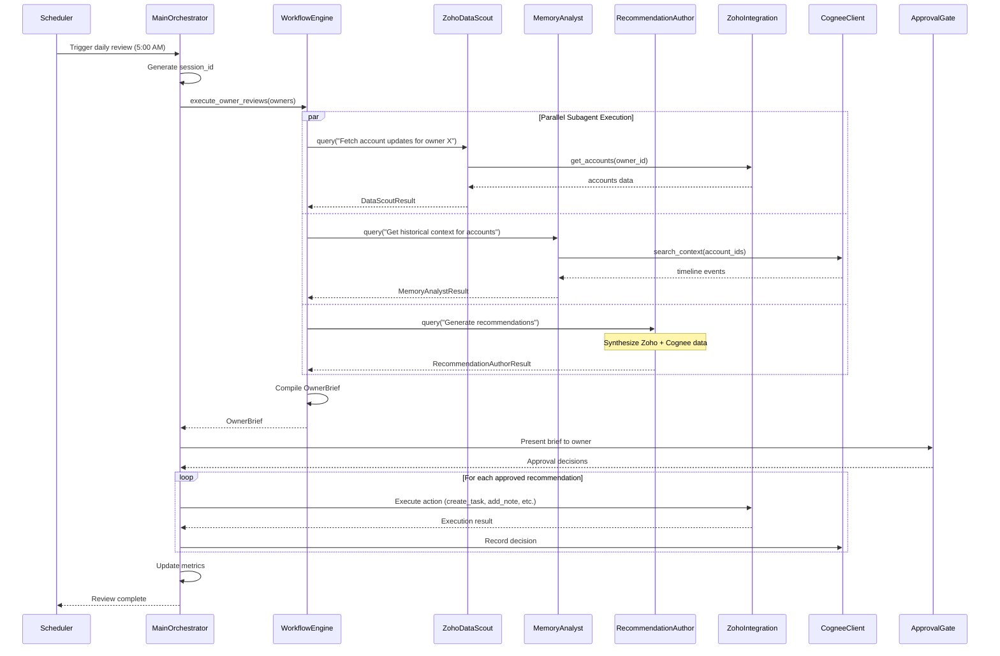
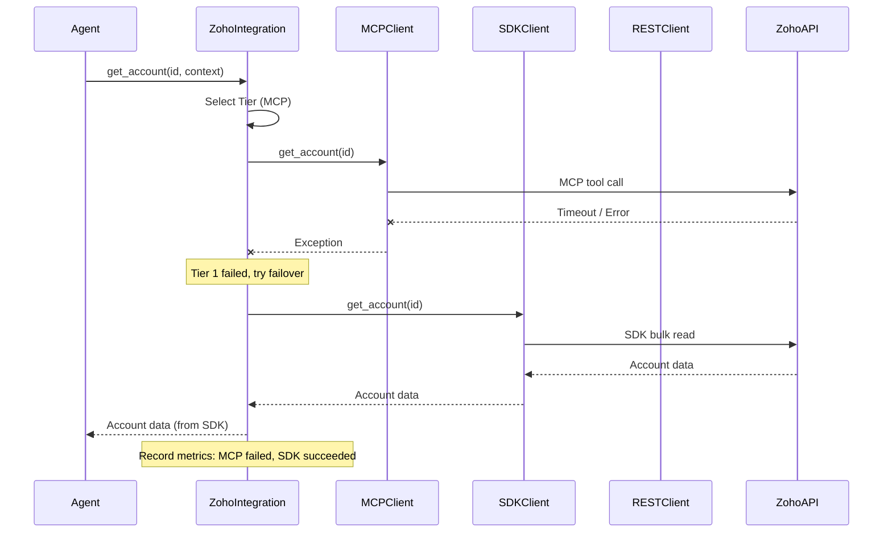
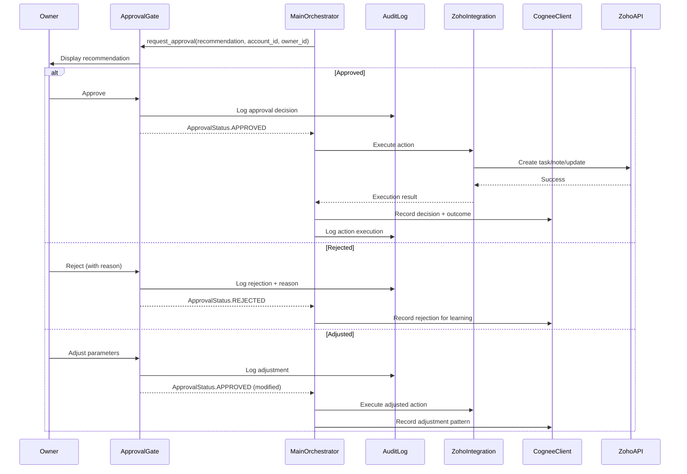
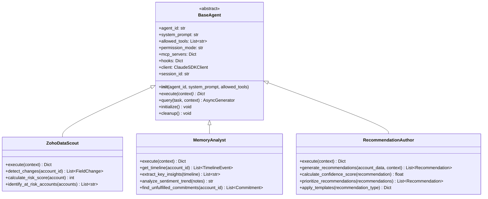
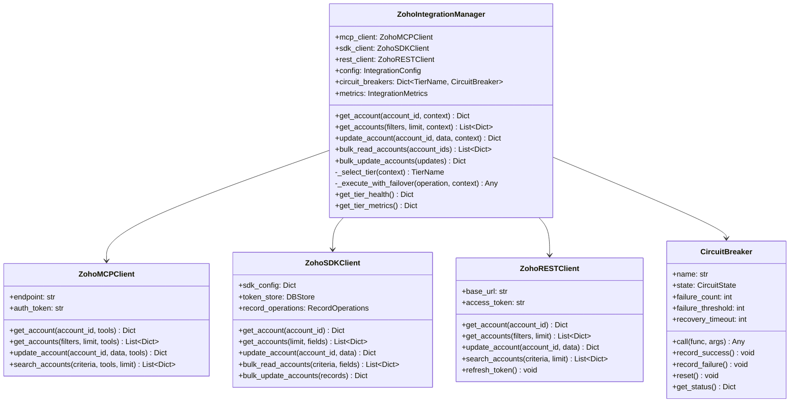
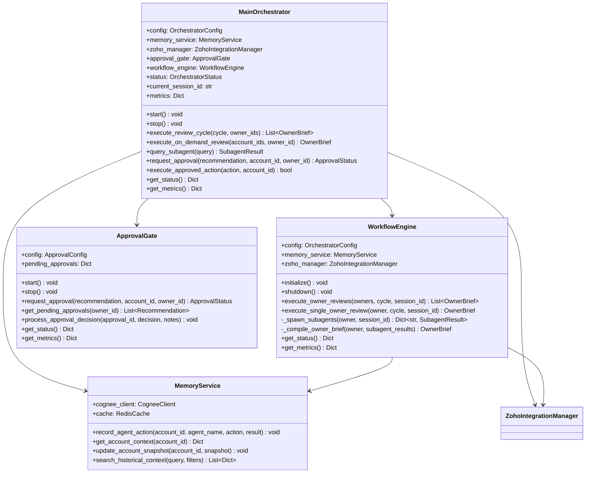

# Sergas Super Account Manager - Complete System Architecture

**Version**: 1.0
**Date**: 2025-10-19
**Status**: Implementation Ready
**Architecture Designer**: System Architecture Team

---

## Table of Contents

1. [Executive Summary](#1-executive-summary)
2. [System Overview](#2-system-overview)
3. [Architecture Layers](#3-architecture-layers)
4. [Component Specifications](#4-component-specifications)
5. [Data Flow Diagrams](#5-data-flow-diagrams)
6. [Event Flow & AG UI Protocol](#6-event-flow--ag-ui-protocol)
7. [State Management](#7-state-management)
8. [API Contracts](#8-api-contracts)
9. [Deployment Architecture](#9-deployment-architecture)
10. [Security Architecture](#10-security-architecture)
11. [Resilience & Fault Tolerance](#11-resilience--fault-tolerance)
12. [Sequence Diagrams](#12-sequence-diagrams)
13. [Class Diagrams](#13-class-diagrams)

---

## 1. Executive Summary

### 1.1 System Purpose

Sergas Super Account Manager is an AI-powered multi-agent system built on Claude Agent SDK (Python 3.14) that automates account portfolio management for Zoho CRM. The system orchestrates specialized agents to analyze accounts, retrieve historical context, and generate actionable recommendations while maintaining strict human-in-the-loop approval workflows.

### 1.2 Key Architectural Principles

1. **Three-Tier Integration Strategy**: Intelligent routing across MCP → SDK → REST for optimal performance
2. **Agent-First Design**: Specialized agents with clear responsibilities and tool permissions
3. **Human-in-the-Loop**: All CRM modifications gated through explicit approval workflows
4. **Resilience by Default**: Circuit breakers, retry policies, and automatic failover
5. **Audit Everything**: Comprehensive logging of all agent actions and decisions
6. **Memory-Augmented**: Persistent context via Cognee knowledge graph

### 1.3 Technology Stack

| Layer | Technology | Purpose |
|-------|------------|---------|
| **Runtime** | Python 3.14 | Agent execution environment |
| **Agent Framework** | Claude Agent SDK | Multi-agent orchestration |
| **AI Model** | Claude Sonnet 4.5 | Language model for agents |
| **CRM Integration** | Zoho CRM (MCP/SDK/REST) | Three-tier data access |
| **Knowledge Graph** | Cognee | Persistent memory layer |
| **Database** | PostgreSQL | Token persistence, audit logs |
| **Cache** | Redis | Session state, rate limiting |
| **Orchestration** | Claude Flow MCP | Agent coordination |
| **API Protocol** | Model Context Protocol | Tool invocation standard |

---

## 2. System Overview

### 2.1 High-Level Architecture Diagram

```
┌─────────────────────────────────────────────────────────────────────┐
│                         Presentation Layer                           │
│  ┌──────────────┐  ┌──────────────┐  ┌──────────────┐              │
│  │  CLI Client  │  │ Web Interface│  │ Slack Bot    │              │
│  │  (Rich)      │  │  (Future)    │  │  (Future)    │              │
│  └──────┬───────┘  └──────┬───────┘  └──────┬───────┘              │
└─────────┼──────────────────┼──────────────────┼─────────────────────┘
          │                  │                  │
          └──────────────────┴──────────────────┘
                             │
          ┌──────────────────▼──────────────────┐
          │      Orchestration Layer            │
          │  ┌────────────────────────────┐     │
          │  │  MainOrchestrator          │     │
          │  │  - Review scheduling       │     │
          │  │  - Subagent coordination   │     │
          │  │  - Approval workflow       │     │
          │  │  - Session management      │     │
          │  └────────┬──────────┬────────┘     │
          │           │          │               │
          │  ┌────────▼────┐  ┌─▼──────────┐   │
          │  │WorkflowEngine│  │ApprovalGate│   │
          │  └─────────────┘  └────────────┘   │
          └────────────┬────────────────────────┘
                       │
          ┌────────────┴────────────────────────┐
          │         Agent Layer                  │
          │                                      │
          │  ┌──────────────┐ ┌───────────────┐ │
          │  │ZohoDataScout │ │MemoryAnalyst │ │
          │  │- Fetch updates│ │- Get context │ │
          │  │- Detect changes│ │- Query graph│ │
          │  └──────────────┘ └───────────────┘ │
          │                                      │
          │  ┌──────────────────────────────┐   │
          │  │ RecommendationAuthor          │   │
          │  │ - Generate suggestions        │   │
          │  │ - Prioritize actions          │   │
          │  │ - Score confidence            │   │
          │  └──────────────────────────────┘   │
          └────────────┬────────────────────────┘
                       │
          ┌────────────┴────────────────────────┐
          │      Integration Layer               │
          │                                      │
          │  ┌──────────────────────────────┐   │
          │  │ ZohoIntegrationManager       │   │
          │  │ - Three-tier routing         │   │
          │  │ - Circuit breaker            │   │
          │  │ - Metrics collection         │   │
          │  └────┬──────────┬──────────┬───┘   │
          │       │          │          │        │
          │  ┌────▼───┐ ┌───▼───┐ ┌───▼────┐   │
          │  │MCP     │ │SDK    │ │REST    │   │
          │  │Client  │ │Client │ │Client  │   │
          │  │(Tier 1)│ │(Tier 2)│ │(Tier 3)│   │
          │  └────┬───┘ └───┬───┘ └───┬────┘   │
          │       │          │          │        │
          │       └──────────┴──────────┘        │
          │                  │                   │
          │  ┌───────────────▼────────────────┐ │
          │  │  CogneeClient                  │ │
          │  │  - Knowledge graph access      │ │
          │  │  - Memory persistence          │ │
          │  └────────────────────────────────┘ │
          └────────────┬────────────────────────┘
                       │
          ┌────────────┴────────────────────────┐
          │         Data Layer                   │
          │                                      │
          │  ┌────────────┐  ┌───────────────┐  │
          │  │PostgreSQL  │  │    Redis      │  │
          │  │- Tokens    │  │- Session state│  │
          │  │- Audit logs│  │- Rate limits  │  │
          │  └────────────┘  └───────────────┘  │
          │                                      │
          │  ┌─────────────────────────────┐    │
          │  │   External Services          │    │
          │  │ ┌─────────┐  ┌────────────┐ │    │
          │  │ │Zoho CRM │  │  Cognee    │ │    │
          │  │ │   API   │  │   Cloud    │ │    │
          │  │ └─────────┘  └────────────┘ │    │
          │  └─────────────────────────────┘    │
          └──────────────────────────────────────┘
```

### 2.2 Component Communication Patterns

| Pattern | Use Case | Technology |
|---------|----------|------------|
| **Synchronous Request/Response** | Agent tool calls | MCP Protocol |
| **Asynchronous Task Queuing** | Background jobs | Celery (future) |
| **Event Streaming** | Approval notifications | WebSocket (future) |
| **Batch Processing** | Bulk data sync | Zoho Python SDK |
| **Circuit Breaker** | Fault tolerance | Custom implementation |

---

## 3. Architecture Layers

### 3.1 Layer Responsibilities

#### Layer 1: Presentation Layer
- **Purpose**: User interaction interfaces
- **Components**: CLI client (Rich library), Web UI (future), Slack bot (future)
- **Technologies**: Python Rich for CLI, React for Web (future)
- **Security Boundary**: Authentication, input validation

#### Layer 2: Orchestration Layer
- **Purpose**: Workflow coordination and approval management
- **Components**: MainOrchestrator, WorkflowEngine, ApprovalGate
- **Technologies**: Claude Agent SDK, asyncio
- **State Management**: Session state in Redis

#### Layer 3: Agent Layer
- **Purpose**: Specialized AI agents for domain-specific tasks
- **Components**: ZohoDataScout, MemoryAnalyst, RecommendationAuthor
- **Technologies**: Claude Agent SDK, Claude Sonnet 4.5
- **Tool Access**: MCP tools via permission hooks

#### Layer 4: Integration Layer
- **Purpose**: External service integration with resilience
- **Components**: ZohoIntegrationManager, CogneeClient, circuit breakers
- **Technologies**: MCP protocol, Zoho Python SDK, REST APIs
- **Resilience**: Circuit breakers, retry policies, fallback strategies

#### Layer 5: Data Layer
- **Purpose**: Data persistence and caching
- **Components**: PostgreSQL, Redis, Zoho CRM, Cognee
- **Technologies**: SQLAlchemy, aioredis, Cognee SDK
- **Data Classification**: Tokens (sensitive), audit logs (retention), cache (ephemeral)

---

## 4. Component Specifications

### 4.1 React Frontend (Future)

**Component**: Web-based Owner Brief Interface

**Responsibilities**:
- Display owner briefs with account updates
- Provide approval/reject UI for recommendations
- Show real-time agent execution status
- Historical brief browsing

**Technology Stack**:
- React 18+ with TypeScript
- CopilotKit for AG UI Protocol integration
- TanStack Query for data fetching
- Tailwind CSS for styling

**Key Components**:
```typescript
// Component hierarchy
<App>
  <BriefDashboard>
    <BriefList />
    <BriefDetail>
      <AccountUpdates />
      <RecommendationList>
        <RecommendationCard>
          <ApprovalButton />
        </RecommendationCard>
      </RecommendationList>
    </BriefDetail>
  </BriefDashboard>
  <AgentMonitor />
</App>
```

**State Management**:
- Local: useState for component state
- Server: TanStack Query for API sync
- Global: Context API for user session
- Real-time: WebSocket for agent events

### 4.2 CopilotKit Layer (Future)

**Purpose**: Bridge React frontend to Claude Agent SDK backend

**Configuration**:
```typescript
// CopilotKit endpoint configuration
const copilotConfig = {
  agentName: "sergas-account-manager",
  endpoint: "/api/copilot",
  actions: [
    {
      name: "approve_recommendation",
      description: "Approve a recommendation for execution",
      parameters: {
        recommendation_id: "string",
        account_id: "string",
        owner_id: "string"
      }
    },
    {
      name: "reject_recommendation",
      description: "Reject a recommendation",
      parameters: {
        recommendation_id: "string",
        reason: "string"
      }
    }
  ],
  render: (props) => <BriefDashboard {...props} />
};
```

**Endpoint Handler**:
```python
# Backend endpoint wrapping MainOrchestrator
@app.post("/api/copilot")
async def copilot_endpoint(request: CopilotRequest):
    orchestrator = get_orchestrator()

    if request.action == "approve_recommendation":
        status = await orchestrator.request_approval(
            recommendation=request.data["recommendation"],
            account_id=request.data["account_id"],
            owner_id=request.data["owner_id"]
        )

        return CopilotResponse(
            status="success",
            result={"approval_status": status.value}
        )
```

### 4.3 Agent Layer Specifications

#### 4.3.1 BaseAgent

**File**: `src/agents/base_agent.py`

**Responsibilities**:
- Initialize Claude SDK client
- Hook system integration (audit, permissions, metrics)
- Session lifecycle management
- Tool permission enforcement

**Interface**:
```python
class BaseAgent(ABC):
    def __init__(
        self,
        agent_id: str,
        system_prompt: str,
        allowed_tools: List[str],
        permission_mode: str = "default",
        mcp_servers: Optional[Dict[str, Any]] = None,
    ) -> None: ...

    @abstractmethod
    async def execute(self, context: Dict[str, Any]) -> Dict[str, Any]: ...

    async def query(
        self, task: str, context: Optional[Dict[str, Any]] = None
    ) -> AsyncGenerator[Dict[str, Any], None]: ...

    async def initialize(self) -> None: ...
    async def cleanup(self) -> None: ...
```

**Key Features**:
- Structured logging with agent_id binding
- Automatic hook registration (audit, permission, metrics)
- Session ID generation and tracking
- Permission mode validation

#### 4.3.2 ZohoDataScout

**Purpose**: Fetch and monitor Zoho CRM data

**System Prompt**:
```
You are the Zoho Data Scout agent. Your responsibilities:
1. Fetch account updates from Zoho CRM
2. Detect field-level changes since last review
3. Identify at-risk accounts based on inactivity
4. Calculate risk scores using multiple signals

Always cite source Zoho record IDs in your findings.
Never modify CRM data - you are read-only.
Prioritize high-risk accounts in your output.
```

**Allowed Tools**:
- `zoho_get_account`
- `zoho_search_accounts`
- `zoho_get_deals`
- `zoho_get_notes`
- `zoho_get_activities`
- `read` (local files)
- `grep` (search patterns)

**Output Schema**:
```python
class DataScoutResult(BaseModel):
    account_id: str
    account_name: str
    owner_id: str
    changes_detected: List[FieldChange]
    risk_score: int  # 0-100
    risk_factors: List[str]
    last_activity_date: datetime
    inactivity_days: int
    source_records: List[str]  # Zoho record IDs
```

#### 4.3.3 MemoryAnalyst

**Purpose**: Retrieve and synthesize historical context from Cognee

**System Prompt**:
```
You are the Memory Analyst agent. Your responsibilities:
1. Query Cognee knowledge graph for account history
2. Extract key events (meetings, commitments, escalations)
3. Identify sentiment trends over time
4. Surface unfulfilled commitments

Provide chronological timelines with source document references.
Highlight patterns and anomalies in account history.
```

**Allowed Tools**:
- `cognee_search_context`
- `cognee_get_timeline`
- `cognee_get_related_entities`
- `read` (local files)

**Output Schema**:
```python
class MemoryAnalystResult(BaseModel):
    account_id: str
    timeline_events: List[TimelineEvent]
    key_insights: List[str]
    sentiment_trend: str  # improving, declining, stable
    unfulfilled_commitments: List[Commitment]
    related_accounts: List[str]
    confidence_score: float  # 0-1
```

#### 4.3.4 RecommendationAuthor

**Purpose**: Generate prioritized, actionable recommendations

**System Prompt**:
```
You are the Recommendation Author agent. Your responsibilities:
1. Synthesize data from Zoho and memory sources
2. Generate specific, actionable recommendations
3. Provide confidence scores and rationale
4. Prioritize by urgency and impact

Always explain your reasoning with supporting data.
Only recommend actions within approved templates.
Include estimated effort and expected outcomes.
```

**Allowed Tools**:
- `generate_recommendation_template`
- `calculate_confidence_score`
- `prioritize_recommendations`
- `read` (local files)

**Output Schema**:
```python
class RecommendationAuthorResult(BaseModel):
    account_id: str
    recommendations: List[Recommendation]
    total_recommendations: int
    critical_count: int
    high_count: int
    estimated_effort_minutes: int
```

class Recommendation(BaseModel):
    recommendation_id: str
    type: RecommendationType  # follow-up, task, escalation, etc.
    title: str
    description: str
    rationale: str
    priority: Priority  # critical, high, medium, low
    confidence_score: float  # 0-1
    supporting_data: List[str]  # Source references
    suggested_action: Dict[str, Any]
    estimated_effort_minutes: int
    expected_outcome: str
```

### 4.4 Integration Layer Specifications

#### 4.4.1 ZohoIntegrationManager

**File**: `src/integrations/zoho/integration_manager.py`

**Purpose**: Intelligent three-tier routing with automatic failover

**Architecture**:
```
┌─────────────────────────────────────┐
│   ZohoIntegrationManager            │
│                                     │
│  ┌────────────────────────────┐    │
│  │  Routing Logic             │    │
│  │  - Context analysis        │    │
│  │  - Tier selection          │    │
│  │  - Failover handling       │    │
│  └────────────────────────────┘    │
│                                     │
│  ┌────────────────────────────┐    │
│  │  Tier 1: MCP Client        │    │
│  │  - Agent operations        │    │
│  │  - Tool permission hooks   │    │
│  │  - Audit integration       │    │
│  └────────────────────────────┘    │
│                                     │
│  ┌────────────────────────────┐    │
│  │  Tier 2: SDK Client        │    │
│  │  - Bulk operations         │    │
│  │  - 100 records/call        │    │
│  │  - Auto token refresh      │    │
│  └────────────────────────────┘    │
│                                     │
│  ┌────────────────────────────┐    │
│  │  Tier 3: REST Client       │    │
│  │  - Emergency fallback      │    │
│  │  - Manual token mgmt       │    │
│  │  - Individual API calls    │    │
│  └────────────────────────────┘    │
│                                     │
│  ┌────────────────────────────┐    │
│  │  Circuit Breakers (3)      │    │
│  │  - Per-tier protection     │    │
│  │  - Health monitoring       │    │
│  │  - Auto-recovery           │    │
│  └────────────────────────────┘    │
└─────────────────────────────────────┘
```

**Routing Logic**:
```python
def _select_tier(self, context: RoutingContext) -> TierName:
    # Rule 1: Agent operations → MCP (Tier 1)
    if context.agent_context and self.config.tier1_mcp.enabled:
        return TierName.MCP

    # Rule 2: Bulk operations (>10 records) → SDK (Tier 2)
    if context.should_use_tier2() and self.config.tier2_sdk.enabled:
        return TierName.SDK

    # Rule 3: Real-time required → MCP (Tier 1)
    if context.requires_realtime and self.config.tier1_mcp.enabled:
        return TierName.MCP

    # Default: MCP or first available tier
    return self._get_default_tier()
```

**Failover Strategy**:
```python
async def _execute_with_failover(
    self, operation: str, context: RoutingContext, **kwargs
) -> Any:
    primary_tier = self._select_tier(context)

    try:
        # Attempt primary tier with circuit breaker
        return await self.circuit_breakers[primary_tier].call(
            self._execute_with_tier, primary_tier, operation, **kwargs
        )
    except Exception as e:
        # Try failover tiers in sequence
        for failover_tier in self._get_failover_tiers(primary_tier):
            try:
                return await self.circuit_breakers[failover_tier].call(
                    self._execute_with_tier, failover_tier, operation, **kwargs
                )
            except Exception:
                continue

        # All tiers failed
        raise ZohoAPIError("Operation failed on all tiers")
```

**Public API**:
```python
class ZohoIntegrationManager:
    # Single record operations
    async def get_account(self, account_id: str, context: Dict) -> Dict
    async def update_account(self, account_id: str, data: Dict, context: Dict) -> Dict

    # Multiple record operations
    async def get_accounts(self, filters: Dict, limit: int, context: Dict) -> List[Dict]
    async def search_accounts(self, criteria: str, limit: int, context: Dict) -> List[Dict]

    # Bulk operations (always use SDK)
    async def bulk_read_accounts(self, account_ids: List[str]) -> List[Dict]
    async def bulk_update_accounts(self, updates: List[Dict]) -> Dict

    # Health and metrics
    def get_tier_health(self) -> Dict[str, Any]
    def get_tier_metrics(self) -> Dict[str, Any]
```

#### 4.4.2 CogneeClient

**File**: `src/integrations/cognee/cognee_client.py`

**Purpose**: Knowledge graph integration for persistent memory

**Key Operations**:
```python
class CogneeClient:
    async def add_context(
        self, content: str, metadata: Dict[str, Any]
    ) -> str: ...

    async def search_context(
        self, query: str, filters: Dict[str, Any], limit: int = 10
    ) -> List[Dict[str, Any]]: ...

    async def get_timeline(
        self, account_id: str, start_date: datetime, end_date: datetime
    ) -> List[TimelineEvent]: ...

    async def upsert_account_snapshot(
        self, account_id: str, snapshot: Dict[str, Any]
    ) -> None: ...
```

### 4.5 Data Layer Specifications

#### 4.5.1 PostgreSQL Schema

**Token Store**:
```sql
CREATE TABLE zoho_oauth_tokens (
    id SERIAL PRIMARY KEY,
    user_email VARCHAR(255) UNIQUE NOT NULL,
    client_id VARCHAR(255) NOT NULL,
    access_token TEXT NOT NULL,
    refresh_token TEXT NOT NULL,
    expires_in INTEGER NOT NULL,
    token_type VARCHAR(50) DEFAULT 'Bearer',
    created_at TIMESTAMP DEFAULT CURRENT_TIMESTAMP,
    updated_at TIMESTAMP DEFAULT CURRENT_TIMESTAMP
);

CREATE INDEX idx_tokens_email ON zoho_oauth_tokens(user_email);
CREATE INDEX idx_tokens_updated ON zoho_oauth_tokens(updated_at);
```

**Audit Log**:
```sql
CREATE TABLE audit_events (
    id UUID PRIMARY KEY DEFAULT gen_random_uuid(),
    event_timestamp TIMESTAMP NOT NULL DEFAULT CURRENT_TIMESTAMP,
    event_type VARCHAR(50) NOT NULL,
    agent_id VARCHAR(100),
    session_id VARCHAR(255),
    tool_name VARCHAR(100),
    tool_input JSONB,
    tool_output JSONB,
    status VARCHAR(20) NOT NULL,
    error_message TEXT,
    duration_ms INTEGER,
    user_id VARCHAR(100),
    ip_address INET,

    CONSTRAINT audit_status_check CHECK (status IN ('started', 'completed', 'failed'))
);

CREATE INDEX idx_audit_timestamp ON audit_events(event_timestamp DESC);
CREATE INDEX idx_audit_agent ON audit_events(agent_id);
CREATE INDEX idx_audit_session ON audit_events(session_id);
CREATE INDEX idx_audit_type ON audit_events(event_type);
```

#### 4.5.2 Redis Cache Structure

**Session State**:
```
Key: session:{session_id}
Type: Hash
Fields:
  - status: "active" | "completed" | "failed"
  - owner_id: "user@example.com"
  - started_at: ISO timestamp
  - updated_at: ISO timestamp
  - briefs_generated: integer
  - approvals_pending: integer
TTL: 24 hours
```

**Rate Limits**:
```
Key: ratelimit:{tier}:{operation}
Type: String (counter)
Value: request count
TTL: 60 seconds (sliding window)
```

**Circuit Breaker State**:
```
Key: circuit:{tier}:{breaker_name}
Type: Hash
Fields:
  - state: "closed" | "open" | "half_open"
  - failure_count: integer
  - last_failure: ISO timestamp
  - opened_at: ISO timestamp
TTL: 5 minutes
```

---

## 5. Data Flow Diagrams

### 5.1 Account Review Workflow Data Flow

```
┌──────────────────────────────────────────────────────────────────┐
│ 1. Review Trigger (Scheduler or On-Demand)                       │
└────────────────────────────┬─────────────────────────────────────┘
                             │
                             ▼
┌─────────────────────────────────────────────────────────────────┐
│ 2. MainOrchestrator                                              │
│    - Generate session_id                                         │
│    - Load owner assignments from cache/DB                        │
│    - Set status = RUNNING                                        │
└────────────────────────────┬────────────────────────────────────┘
                             │
                             ▼
┌─────────────────────────────────────────────────────────────────┐
│ 3. WorkflowEngine.execute_owner_reviews()                        │
│    - For each owner, spawn 3 parallel subagents                  │
└────────────┬────────────────┬────────────────┬──────────────────┘
             │                │                │
     ┌───────▼──────┐  ┌─────▼──────┐  ┌──────▼────────┐
     │ ZohoDataScout│  │MemoryAnalyst│  │Recommendation │
     │              │  │             │  │    Author     │
     └───────┬──────┘  └─────┬──────┘  └──────┬────────┘
             │                │                │
             │                │                │
     ┌───────▼──────────┐  ┌─▼──────────────┐ │
     │ ZohoIntegration  │  │ CogneeClient   │ │
     │    Manager       │  │                │ │
     │ (3-tier routing) │  │ - Search context│ │
     │ - Get accounts   │  │ - Get timeline  │ │
     │ - Detect changes │  │ - Get insights  │ │
     └───────┬──────────┘  └─┬──────────────┘ │
             │                │                │
             │        ┌───────▼────────────────▼────────┐
             │        │ Recommendation Generation       │
             │        │ - Synthesize Zoho + Cognee data│
             │        │ - Apply templates              │
             │        │ - Calculate confidence         │
             │        │ - Prioritize by urgency        │
             │        └───────┬────────────────────────┘
             │                │                │
             └────────────────┴────────────────┘
                             │
                             ▼
┌─────────────────────────────────────────────────────────────────┐
│ 4. Aggregate Subagent Results                                    │
│    - Compile OwnerBrief                                          │
│    - Calculate estimated review time                             │
│    - Identify high-priority accounts                             │
└────────────────────────────┬────────────────────────────────────┘
                             │
                             ▼
┌─────────────────────────────────────────────────────────────────┐
│ 5. ApprovalGate                                                  │
│    - Present brief to owner                                      │
│    - For each recommendation:                                    │
│      - Show rationale and supporting data                        │
│      - Request approval/reject/adjust                            │
│    - Record decision in audit log                                │
└────────────────────────────┬────────────────────────────────────┘
                             │
                ┌────────────┴──────────────┐
                │                           │
        ┌───────▼────────┐          ┌──────▼──────┐
        │   APPROVED     │          │  REJECTED   │
        │                │          │             │
        └───────┬────────┘          └──────┬──────┘
                │                           │
                ▼                           │
┌──────────────────────────────┐            │
│ 6. Execute Approved Actions  │            │
│    - ZohoIntegrationManager  │            │
│      - Create tasks          │            │
│      - Add notes             │            │
│      - Update accounts       │            │
└────────────┬─────────────────┘            │
             │                              │
             └──────────────┬───────────────┘
                            │
                            ▼
┌──────────────────────────────────────────────────────────────────┐
│ 7. Memory Update                                                  │
│    - CogneeClient.add_context()                                  │
│      - Store decision (approved/rejected)                         │
│      - Update account snapshot                                    │
│      - Record action outcomes                                     │
└────────────────────────────┬─────────────────────────────────────┘
                             │
                             ▼
┌──────────────────────────────────────────────────────────────────┐
│ 8. Session Completion                                             │
│    - Update metrics                                               │
│    - Export session state                                         │
│    - Set status = IDLE                                            │
│    - Log completion                                               │
└──────────────────────────────────────────────────────────────────┘
```

### 5.2 Three-Tier Routing Data Flow

```
Agent Query: "Get account ACC-12345"
         │
         ▼
┌─────────────────────────────┐
│ RoutingContext Analysis     │
│ - agent_context: True       │
│ - record_count: 1           │
│ - requires_realtime: False  │
└────────────┬────────────────┘
             │
             ▼
┌─────────────────────────────┐
│ Tier Selection               │
│ Rule: agent_context → MCP   │
│ Selected: Tier 1 (MCP)      │
└────────────┬────────────────┘
             │
             ▼
┌─────────────────────────────┐
│ Circuit Breaker Check       │
│ State: CLOSED ✓             │
└────────────┬────────────────┘
             │
             ▼
┌─────────────────────────────┐
│ Execute via MCP Client      │
│ Tool: zoho_get_account      │
└────────────┬────────────────┘
             │
     ┌───────┴───────┐
     │               │
SUCCESS            FAILURE
     │               │
     ▼               ▼
┌─────────┐   ┌────────────────┐
│ Return  │   │ Failover Logic │
│ Result  │   │ Try: SDK (Tier 2)│
└─────────┘   └────────┬───────┘
                       │
               ┌───────┴───────┐
               │               │
           SUCCESS          FAILURE
               │               │
               ▼               ▼
          ┌─────────┐   ┌────────────┐
          │ Return  │   │ Try: REST  │
          │ Result  │   │  (Tier 3)  │
          └─────────┘   └─────┬──────┘
                              │
                      ┌───────┴───────┐
                      │               │
                  SUCCESS          FAILURE
                      │               │
                      ▼               ▼
                 ┌─────────┐   ┌───────────┐
                 │ Return  │   │Raise Error│
                 │ Result  │   │All Failed │
                 └─────────┘   └───────────┘
```

---

## 6. Event Flow & AG UI Protocol

### 6.1 AG UI Protocol Events

The system emits structured events following the AG UI Protocol for real-time UI updates:

**Event Types**:
```typescript
type AGEvent =
  | { type: "session_start", data: SessionInfo }
  | { type: "agent_thinking", data: ThinkingState }
  | { type: "tool_use", data: ToolInvocation }
  | { type: "approval_required", data: ApprovalRequest }
  | { type: "progress_update", data: ProgressInfo }
  | { type: "session_complete", data: CompletionInfo }
```

**Event Flow Example**:
```
1. session_start
   {
     "type": "session_start",
     "session_id": "review_daily_2025-10-19T08:00:00",
     "owner_id": "user@example.com",
     "accounts_count": 45
   }

2. agent_thinking (ZohoDataScout)
   {
     "type": "agent_thinking",
     "agent_id": "zoho_data_scout",
     "task": "Fetching account updates for 45 accounts",
     "progress": 0.2
   }

3. tool_use
   {
     "type": "tool_use",
     "tool": "zoho_get_accounts",
     "input": { "filters": {"status": "active"}, "limit": 45 },
     "status": "executing"
   }

4. progress_update
   {
     "type": "progress_update",
     "step": "data_collection",
     "progress": 0.6,
     "message": "Retrieved 45 accounts, analyzing changes..."
   }

5. approval_required
   {
     "type": "approval_required",
     "recommendation_id": "rec-abc123",
     "account_id": "ACC-12345",
     "action": "create_task",
     "rationale": "Account inactive for 35 days, follow-up required",
     "confidence": 0.85
   }

6. session_complete
   {
     "type": "session_complete",
     "session_id": "review_daily_2025-10-19T08:00:00",
     "briefs_generated": 1,
     "recommendations_total": 8,
     "approvals_granted": 6,
     "duration_seconds": 542
   }
```

### 6.2 WebSocket Event Streaming (Future)

**Server Implementation**:
```python
from fastapi import WebSocket, WebSocketDisconnect

@app.websocket("/ws/session/{session_id}")
async def websocket_endpoint(websocket: WebSocket, session_id: str):
    await websocket.accept()

    try:
        # Subscribe to session events
        async for event in orchestrator.stream_session_events(session_id):
            await websocket.send_json(event)
    except WebSocketDisconnect:
        logger.info("client_disconnected", session_id=session_id)
```

**Client Implementation (React)**:
```typescript
// Using CopilotKit's useAgentState hook
const { state, events } = useAgentState({
  agentId: "sergas-account-manager",
  sessionId: sessionId,
  onEvent: (event: AGEvent) => {
    switch (event.type) {
      case "approval_required":
        showApprovalModal(event.data);
        break;
      case "progress_update":
        updateProgressBar(event.data.progress);
        break;
    }
  }
});
```

---

## 7. State Management

### 7.1 State Distribution

| State Type | Storage | Scope | Lifetime | Example |
|------------|---------|-------|----------|---------|
| **Frontend State** | React useState | Component | Component mount | UI selections |
| **Session State** | Redis | Session | 24 hours | Active review context |
| **Persistent State** | PostgreSQL | Global | Permanent | Audit logs |
| **Knowledge State** | Cognee | Account | Permanent | Historical context |
| **Cache State** | Redis | Tier | TTL-based | Rate limit counters |

### 7.2 Session State Schema

```python
class SessionState(BaseModel):
    session_id: str
    status: OrchestratorStatus
    owner_id: str
    cycle: ReviewCycle

    # Progress tracking
    accounts_total: int
    accounts_processed: int
    current_step: str  # "data_collection", "memory_analysis", etc.

    # Subagent tracking
    subagent_results: Dict[str, SubagentResult]
    active_subagents: List[str]

    # Brief building
    updates_collected: List[AccountUpdate]
    recommendations_generated: List[Recommendation]
    approvals_pending: List[str]

    # Metrics
    started_at: datetime
    updated_at: datetime
    estimated_completion: datetime

    # Error tracking
    errors: List[str]
    warnings: List[str]
```

### 7.3 State Persistence

**Redis Storage**:
```python
async def save_session_state(session_id: str, state: SessionState):
    redis_client = get_redis_client()

    # Store as JSON with 24-hour TTL
    await redis_client.setex(
        f"session:{session_id}",
        86400,  # 24 hours
        state.model_dump_json()
    )
```

**PostgreSQL Backup**:
```python
async def backup_session_state(session_id: str, state: SessionState):
    # Store completed sessions for auditing
    async with get_db_session() as db:
        session_record = SessionHistory(
            session_id=session_id,
            owner_id=state.owner_id,
            cycle=state.cycle,
            final_state=state.model_dump(),
            completed_at=datetime.utcnow()
        )
        db.add(session_record)
        await db.commit()
```

---

## 8. API Contracts

### 8.1 TypeScript Types (Frontend)

```typescript
// Account data
interface Account {
  id: string;
  name: string;
  owner: {
    id: string;
    name: string;
    email: string;
  };
  status: "active" | "inactive" | "at_risk" | "churned";
  health_score: number;  // 0-100
  risk_score: number;    // 0-100
  last_activity_date: string; // ISO timestamp
}

// Account update
interface AccountUpdate {
  account_id: string;
  account_name: string;
  owner_id: string;
  changes: FieldChange[];
  risk_score: number;
  requires_attention: boolean;
  detected_at: string;
}

interface FieldChange {
  field: string;
  old_value: any;
  new_value: any;
  changed_at: string;
}

// Recommendation
interface Recommendation {
  recommendation_id: string;
  type: "follow_up" | "task" | "escalation" | "health_check";
  title: string;
  description: string;
  rationale: string;
  priority: "critical" | "high" | "medium" | "low";
  confidence_score: number;  // 0-1
  supporting_data: string[];
  suggested_action: {
    type: "create_task" | "add_note" | "update_account";
    data: Record<string, any>;
  };
  estimated_effort_minutes: number;
  expected_outcome: string;
}

// Owner brief
interface OwnerBrief {
  owner_id: string;
  owner_name: string;
  cycle: "daily" | "weekly" | "on_demand";
  generated_at: string;

  accounts_reviewed: number;
  accounts_with_changes: number;
  high_priority_accounts: string[];

  updates: AccountUpdate[];
  recommendations: Recommendation[];

  total_recommendations: number;
  critical_recommendations: number;
  estimated_review_time_minutes: number;
}
```

### 8.2 Python Schemas (Backend)

```python
from pydantic import BaseModel, Field
from datetime import datetime
from typing import List, Dict, Any, Optional
from enum import Enum

# Account models
class AccountStatus(str, Enum):
    ACTIVE = "active"
    INACTIVE = "inactive"
    AT_RISK = "at_risk"
    CHURNED = "churned"

class Account(BaseModel):
    id: str
    name: str
    owner: OwnerInfo
    status: AccountStatus
    health_score: int = Field(ge=0, le=100)
    risk_score: int = Field(ge=0, le=100)
    last_activity_date: datetime

class OwnerInfo(BaseModel):
    id: str
    name: str
    email: str

# Update models
class FieldChange(BaseModel):
    field: str
    old_value: Any
    new_value: Any
    changed_at: datetime

class AccountUpdate(BaseModel):
    account_id: str
    account_name: str
    owner_id: str
    changes: List[FieldChange]
    risk_score: int = Field(ge=0, le=100)
    requires_attention: bool = False
    detected_at: datetime = Field(default_factory=datetime.utcnow)

# Recommendation models
class RecommendationType(str, Enum):
    FOLLOW_UP = "follow_up"
    TASK = "task"
    ESCALATION = "escalation"
    HEALTH_CHECK = "health_check"

class Priority(str, Enum):
    CRITICAL = "critical"
    HIGH = "high"
    MEDIUM = "medium"
    LOW = "low"

class SuggestedAction(BaseModel):
    type: str  # create_task, add_note, update_account
    data: Dict[str, Any]

class Recommendation(BaseModel):
    recommendation_id: str
    type: RecommendationType
    title: str
    description: str
    rationale: str
    priority: Priority
    confidence_score: float = Field(ge=0, le=1)
    supporting_data: List[str]
    suggested_action: SuggestedAction
    estimated_effort_minutes: int
    expected_outcome: str

# Brief models
class ReviewCycle(str, Enum):
    DAILY = "daily"
    WEEKLY = "weekly"
    ON_DEMAND = "on_demand"

class OwnerBrief(BaseModel):
    owner_id: str
    owner_name: str
    cycle: ReviewCycle
    generated_at: datetime = Field(default_factory=datetime.utcnow)

    accounts_reviewed: int = 0
    accounts_with_changes: int = 0
    high_priority_accounts: List[str] = Field(default_factory=list)

    updates: List[AccountUpdate] = Field(default_factory=list)
    recommendations: List[Recommendation] = Field(default_factory=list)

    total_recommendations: int = 0
    critical_recommendations: int = 0
    estimated_review_time_minutes: int = 0
```

### 8.3 JSON Examples

**GET /api/briefs/{owner_id}/latest**

Response:
```json
{
  "owner_id": "user@example.com",
  "owner_name": "Sarah Chen",
  "cycle": "daily",
  "generated_at": "2025-10-19T08:00:00Z",
  "accounts_reviewed": 45,
  "accounts_with_changes": 8,
  "high_priority_accounts": ["ACC-12345", "ACC-67890"],
  "updates": [
    {
      "account_id": "ACC-12345",
      "account_name": "Acme Corporation",
      "owner_id": "user@example.com",
      "changes": [
        {
          "field": "status",
          "old_value": "active",
          "new_value": "at_risk",
          "changed_at": "2025-10-18T14:30:00Z"
        }
      ],
      "risk_score": 75,
      "requires_attention": true,
      "detected_at": "2025-10-19T07:45:00Z"
    }
  ],
  "recommendations": [
    {
      "recommendation_id": "rec-abc123",
      "type": "follow_up",
      "title": "Follow up on inactive account",
      "description": "Account has been inactive for 35 days",
      "rationale": "No activity detected since 2025-09-14. Previous follow-up commitment on 2025-09-01 unfulfilled.",
      "priority": "high",
      "confidence_score": 0.85,
      "supporting_data": [
        "zoho:ACC-12345:last_activity",
        "cognee:commitment:cmt-456"
      ],
      "suggested_action": {
        "type": "create_task",
        "data": {
          "subject": "Follow up with Acme Corporation",
          "description": "Check status and address unfulfilled commitment",
          "due_date": "2025-10-21",
          "priority": "high"
        }
      },
      "estimated_effort_minutes": 15,
      "expected_outcome": "Re-engage account, reduce risk score"
    }
  ],
  "total_recommendations": 8,
  "critical_recommendations": 2,
  "estimated_review_time_minutes": 25
}
```

**POST /api/approvals**

Request:
```json
{
  "recommendation_id": "rec-abc123",
  "account_id": "ACC-12345",
  "owner_id": "user@example.com",
  "action": "approve",
  "notes": "Approved - will call tomorrow"
}
```

Response:
```json
{
  "approval_id": "appr-xyz789",
  "status": "approved",
  "recommendation_id": "rec-abc123",
  "approved_at": "2025-10-19T09:15:00Z",
  "approved_by": "user@example.com",
  "execution_status": "pending"
}
```

---

## 9. Deployment Architecture

### 9.1 Service Topology

```
┌──────────────────────────────────────────────────────┐
│                 Load Balancer (ALB)                   │
│                  HTTPS (Port 443)                     │
└────────────────────┬─────────────────────────────────┘
                     │
     ┌───────────────┴──────────────┐
     │                               │
┌────▼─────┐                  ┌─────▼────┐
│  Agent   │                  │  Agent   │
│  Host 1  │                  │  Host 2  │
│          │                  │          │
│ ┌──────┐ │                  │ ┌──────┐ │
│ │Python│ │                  │ │Python│ │
│ │ 3.14 │ │                  │ │ 3.14 │ │
│ └──────┘ │                  │ └──────┘ │
│          │                  │          │
│ ┌──────┐ │                  │ ┌──────┐ │
│ │Claude│ │                  │ │Claude│ │
│ │ SDK  │ │                  │ │ SDK  │ │
│ └──────┘ │                  │ └──────┘ │
└────┬─────┘                  └─────┬────┘
     │                               │
     └───────────────┬───────────────┘
                     │
        ┌────────────▼────────────┐
        │   Redis Cluster         │
        │   - Session state       │
        │   - Rate limiting       │
        │   - Circuit breakers    │
        └────────────┬────────────┘
                     │
        ┌────────────▼────────────┐
        │   PostgreSQL (RDS)      │
        │   - OAuth tokens        │
        │   - Audit logs          │
        │   - Session history     │
        └────────────┬────────────┘
                     │
        ┌────────────▼────────────┐
        │   Secrets Manager       │
        │   (AWS Secrets Manager) │
        │   - API keys            │
        │   - OAuth credentials   │
        └─────────────────────────┘

External Services:
┌────────────────┐  ┌───────────────┐
│  Zoho CRM API  │  │ Cognee Cloud  │
│  (3 Tiers)     │  │ Knowledge     │
│  - MCP         │  │ Graph         │
│  - SDK         │  │               │
│  - REST        │  │               │
└────────────────┘  └───────────────┘
```

### 9.2 Container Architecture

**Dockerfile**:
```dockerfile
FROM python:3.14-slim

# Install system dependencies
RUN apt-get update && apt-get install -y \
    gcc \
    postgresql-client \
    && rm -rf /var/lib/apt/lists/*

# Set working directory
WORKDIR /app

# Install Python dependencies
COPY requirements.txt .
RUN pip install --no-cache-dir -r requirements.txt

# Copy application code
COPY src/ ./src/
COPY config/ ./config/

# Create non-root user
RUN useradd -m -u 1000 agent && chown -R agent:agent /app
USER agent

# Expose ports
EXPOSE 8000

# Health check
HEALTHCHECK --interval=30s --timeout=10s --start-period=5s --retries=3 \
    CMD python -c "import requests; requests.get('http://localhost:8000/health')"

# Run application
CMD ["python", "-m", "src.main"]
```

**Docker Compose (Development)**:
```yaml
version: '3.8'

services:
  agent:
    build: .
    ports:
      - "8000:8000"
    environment:
      - ANTHROPIC_API_KEY=${ANTHROPIC_API_KEY}
      - REDIS_URL=redis://redis:6379/0
      - DATABASE_URL=postgresql://postgres:postgres@db:5432/sergas
    depends_on:
      - redis
      - db
    volumes:
      - ./src:/app/src
      - ./config:/app/config

  redis:
    image: redis:7-alpine
    ports:
      - "6379:6379"
    volumes:
      - redis_data:/data

  db:
    image: postgres:16-alpine
    environment:
      - POSTGRES_DB=sergas
      - POSTGRES_USER=postgres
      - POSTGRES_PASSWORD=postgres
    ports:
      - "5432:5432"
    volumes:
      - postgres_data:/var/lib/postgresql/data

volumes:
  redis_data:
  postgres_data:
```

### 9.3 Scaling Strategy

**Horizontal Scaling**:
- Stateless agent hosts (scale to N instances)
- Load balancer distributes requests
- Shared state via Redis and PostgreSQL
- Session affinity not required

**Vertical Scaling**:
- Increase Zoho API tier for higher rate limits
- Scale PostgreSQL for audit log writes
- Redis cluster for high-throughput caching

**Auto-Scaling Configuration**:
```yaml
# Kubernetes HPA example
apiVersion: autoscaling/v2
kind: HorizontalPodAutoscaler
metadata:
  name: agent-host-hpa
spec:
  scaleTargetRef:
    apiVersion: apps/v1
    kind: Deployment
    name: agent-host
  minReplicas: 2
  maxReplicas: 10
  metrics:
  - type: Resource
    resource:
      name: cpu
      target:
        type: Utilization
        averageUtilization: 70
  - type: Resource
    resource:
      name: memory
      target:
        type: Utilization
        averageUtilization: 80
```

### 9.4 Networking

**Security Groups**:
```
Load Balancer:
  Inbound: 443 (HTTPS) from 0.0.0.0/0
  Outbound: 8000 to Agent Hosts

Agent Hosts:
  Inbound: 8000 from Load Balancer
  Outbound:
    - 6379 to Redis
    - 5432 to PostgreSQL
    - 443 to Zoho API
    - 443 to Cognee API

Redis:
  Inbound: 6379 from Agent Hosts

PostgreSQL:
  Inbound: 5432 from Agent Hosts
```

**DNS Configuration**:
```
Primary: agents.sergas.com → Load Balancer
API: api.agents.sergas.com → Load Balancer
WebSocket (future): ws.agents.sergas.com → Load Balancer
```

---

## 10. Security Architecture

### 10.1 Authentication Flow

```
┌──────────────┐
│    User      │
└──────┬───────┘
       │
       │ 1. Login request
       ▼
┌──────────────┐
│ Auth Service │ (Future: OAuth2/SAML)
└──────┬───────┘
       │
       │ 2. JWT token
       ▼
┌──────────────┐
│    Client    │
└──────┬───────┘
       │
       │ 3. API request + JWT
       ▼
┌──────────────┐
│API Gateway   │
└──────┬───────┘
       │
       │ 4. Verify JWT
       ▼
┌──────────────┐
│MainOrchestrator│
└──────────────┘
```

### 10.2 Authorization Model

**Role-Based Access Control**:
```python
class UserRole(Enum):
    ACCOUNT_EXECUTIVE = "account_executive"  # View briefs, approve actions
    SALES_MANAGER = "sales_manager"          # View team metrics
    OPERATIONS_ADMIN = "operations_admin"    # System configuration
    SYSTEM_ADMIN = "system_admin"            # Full access

ROLE_PERMISSIONS = {
    UserRole.ACCOUNT_EXECUTIVE: [
        "view_own_briefs",
        "approve_own_recommendations",
        "view_own_accounts",
    ],
    UserRole.SALES_MANAGER: [
        "view_team_briefs",
        "view_team_metrics",
        "view_team_accounts",
    ],
    UserRole.OPERATIONS_ADMIN: [
        "configure_agents",
        "manage_integrations",
        "view_audit_logs",
    ],
    UserRole.SYSTEM_ADMIN: [
        "all",
    ],
}
```

### 10.3 Data Encryption

**At Rest**:
- PostgreSQL: Encrypted storage (AWS RDS encryption)
- Redis: Encrypted volumes
- Secrets Manager: AWS KMS encryption
- Audit logs: Field-level encryption for sensitive data

**In Transit**:
- TLS 1.3 for all API communications
- Certificate pinning for Zoho/Cognee APIs
- Encrypted WebSocket connections (WSS)

### 10.4 Secret Management

**AWS Secrets Manager Integration**:
```python
import boto3
from botocore.exceptions import ClientError

class SecretsManager:
    def __init__(self, region: str = "us-west-2"):
        self.client = boto3.client("secretsmanager", region_name=region)

    def get_secret(self, secret_name: str) -> Dict[str, Any]:
        try:
            response = self.client.get_secret_value(SecretId=secret_name)
            return json.loads(response["SecretString"])
        except ClientError as e:
            logger.error("secret_retrieval_failed", error=str(e))
            raise

    def rotate_secret(self, secret_name: str, new_value: str) -> None:
        self.client.put_secret_value(
            SecretId=secret_name,
            SecretString=new_value,
        )
```

**Secret Rotation Schedule**:
```
Anthropic API Key: Manual rotation (quarterly)
Zoho OAuth Tokens: Automatic refresh (hourly)
Database Passwords: Automatic rotation (90 days)
Webhook Tokens: Manual rotation (monthly)
```

---

## 11. Resilience & Fault Tolerance

### 11.1 Circuit Breaker Implementation

**Circuit Breaker States**:
```
┌─────────┐  failure_count < threshold  ┌─────────┐
│ CLOSED  │──────────────────────────────▶│ CLOSED  │
└────┬────┘                               └─────────┘
     │
     │ failure_count >= threshold
     ▼
┌─────────┐                               ┌─────────┐
│  OPEN   │◀──────────────────────────────│  OPEN   │
└────┬────┘  timeout not elapsed          └─────────┘
     │
     │ timeout elapsed
     ▼
┌──────────┐  next call succeeds         ┌─────────┐
│HALF_OPEN │─────────────────────────────▶│ CLOSED  │
└────┬─────┘                              └─────────┘
     │
     │ next call fails
     ▼
┌─────────┐
│  OPEN   │
└─────────┘
```

**Configuration**:
```python
class CircuitBreakerConfig:
    failure_threshold: int = 5       # Open after 5 failures
    recovery_timeout: int = 60       # Try recovery after 60 seconds
    success_threshold: int = 2       # Close after 2 successes
    monitored_exceptions: List[Type[Exception]] = [
        ZohoAPIError,
        ZohoRateLimitError,
        TimeoutError,
    ]
```

### 11.2 Retry Policies

**Exponential Backoff**:
```python
from tenacity import retry, stop_after_attempt, wait_exponential

@retry(
    stop=stop_after_attempt(3),
    wait=wait_exponential(multiplier=1, min=1, max=10),
    retry=retry_if_exception_type((ZohoAPIError, TimeoutError)),
)
async def execute_with_retry(operation: Callable) -> Any:
    return await operation()
```

**Retry Decision Matrix**:
| Error Type | Retry? | Max Attempts | Backoff |
|------------|--------|--------------|---------|
| Network timeout | Yes | 3 | Exponential (1s, 2s, 4s) |
| Rate limit (429) | Yes | 5 | Fixed (60s) |
| Auth error (401) | Yes (once) | 1 | Immediate |
| Client error (400) | No | 0 | - |
| Server error (500) | Yes | 3 | Exponential |
| Circuit open | No | 0 | - |

### 11.3 Fallback Strategies

**Degraded Mode Operations**:
```python
class DegradedMode(Enum):
    NORMAL = "normal"              # All systems operational
    ZOHO_DEGRADED = "zoho_degraded"  # Using cached data
    COGNEE_DEGRADED = "cognee_degraded"  # No historical context
    CRITICAL = "critical"           # Manual intervention required

async def execute_in_degraded_mode(mode: DegradedMode):
    if mode == DegradedMode.ZOHO_DEGRADED:
        # Use cached account data, skip change detection
        return await get_cached_accounts()

    elif mode == DegradedMode.COGNEE_DEGRADED:
        # Skip historical context, generate recommendations without memory
        return await generate_recommendations_basic()

    elif mode == DegradedMode.CRITICAL:
        # Alert operations, queue requests for manual processing
        await alert_operations("system_critical")
        return {"status": "queued"}
```

### 11.4 Health Monitoring

**Health Check Endpoint**:
```python
@app.get("/health")
async def health_check() -> Dict[str, Any]:
    return {
        "status": "healthy",
        "timestamp": datetime.utcnow().isoformat(),
        "version": "1.0.0",
        "dependencies": {
            "redis": await check_redis_health(),
            "postgresql": await check_postgres_health(),
            "zoho_mcp": await check_zoho_mcp_health(),
            "zoho_sdk": await check_zoho_sdk_health(),
            "cognee": await check_cognee_health(),
        },
        "circuit_breakers": {
            "MCP": get_circuit_breaker_status("MCP"),
            "SDK": get_circuit_breaker_status("SDK"),
            "REST": get_circuit_breaker_status("REST"),
        }
    }
```

**Liveness vs Readiness**:
```
Liveness Probe:
  Path: /health/live
  Check: Application process running
  Failure Action: Restart container

Readiness Probe:
  Path: /health/ready
  Check: Dependencies accessible + Circuit breakers not all open
  Failure Action: Remove from load balancer
```

---

## 12. Sequence Diagrams

### 12.1 Daily Review Cycle



### 12.2 Three-Tier Failover Sequence



### 12.3 Approval Workflow



---

## 13. Class Diagrams

### 13.1 Agent Hierarchy



### 13.2 Integration Layer



### 13.3 Orchestration Layer



---

## Summary

This comprehensive architecture document provides implementation-ready specifications for the Sergas Super Account Manager system. All layers, components, data flows, and API contracts are defined with sufficient detail for agent-based implementation.

**Key Design Decisions**:
1. **Three-tier integration strategy** optimizes for agent operations (MCP), bulk performance (SDK), and reliability (REST)
2. **Circuit breakers and retry policies** ensure resilience across all integration points
3. **Human-in-the-loop approval** maintains control while automating analysis
4. **Memory-augmented agents** leverage Cognee for persistent context
5. **Comprehensive audit logging** ensures compliance and traceability

**Next Steps**:
1. Review architecture with stakeholders
2. Validate API contracts with frontend team
3. Confirm Zoho API tier and rate limits
4. Set up development environment per deployment architecture
5. Begin implementation following SPARC methodology

---

**Relevant Files**:
- `/Users/mohammadabdelrahman/Projects/sergas_agents/src/agents/base_agent.py`
- `/Users/mohammadabdelrahman/Projects/sergas_agents/src/integrations/zoho/integration_manager.py`
- `/Users/mohammadabdelrahman/Projects/sergas_agents/src/orchestrator/main_orchestrator.py`
- `/Users/mohammadabdelrahman/Projects/sergas_agents/docs/data_models.md`
- `/Users/mohammadabdelrahman/Projects/sergas_agents/docs/zoho_mcp_integration_design.md`
