# 🔗 Zoho CRM Integration

<div align="center">


**Comprehensive CRM Integration with Multi-Tier Architecture**

</div>

---

## 🎯 Overview

The Zoho CRM Integration provides a robust, multi-tier connection to Zoho CRM services, enabling agents to retrieve account data, monitor changes, and generate actionable insights. The architecture prioritizes the official Zoho MCP endpoint while providing fallback mechanisms for optimal reliability and performance.

### ✨ Key Features

- **🔗 Multi-Tier Integration**: MCP (primary) → Python SDK (secondary) → REST API (fallback)
- **🛡️ Enterprise Security**: OAuth 2.0 with automatic token rotation and secrets management
- **⚡ High Performance**: Bulk operations with 100 records/call via Python SDK
- **🔄 Real-time Sync**: Webhook-driven incremental updates
- **📊 Comprehensive Coverage**: Accounts, deals, contacts, activities, and custom modules

---

## 🏗️ Architecture

```mermaid
graph TB
    subgraph "🤖 Agent Layer"
        DS[Zoho Data Scout]
        RA[Recommendation Author]
        O[Orchestrator]
    end
    
    subgraph "🔗 Integration Manager"
        IM[ZohoIntegrationManager]
        RT[Request Router]
        CB[Circuit Breaker]
    end
    
    subgraph "📡 Client Layer"
        MCP[Zoho MCP Client]
        SDK[Python SDK Client]
        REST[REST API Client]
    end
    
    subgraph "🔐 Security Layer"
        SM[Secrets Manager]
        OAUTH[OAuth Handler]
        TOKEN[Token Store]
    end
    
    subgraph "💾 Zoho CRM"
        API[Zoho CRM API]
        WEBHOOK[Webhook Endpoints]
        MODULES[CRM Modules]
    end
    
    DS --> IM
    RA --> IM
    O --> IM
    
    IM --> RT
    RT --> CB
    
    CB --> MCP
    CB --> SDK
    CB --> REST
    
    MCP --> OAUTH
    SDK --> OAUTH
    REST --> OAUTH
    
    OAUTH --> SM
    OAUTH --> TOKEN
    
    MCP --> API
    SDK --> API
    REST --> API
    
    API --> WEBHOOK
    API --> MODULES
```

<div align="center">



</div>

---

## 🚀 Quick Start

### Prerequisites

- **Zoho CRM Account** with API access
- **OAuth Client** registered in Zoho Developer Console
- **Python 3.14+** environment
- **PostgreSQL** for token persistence (SDK)

### Installation

1. **Install Dependencies**
   ```bash
   pip install zohocrmsdk8-0
   pip install requests oauthlib
   ```

2. **Configure OAuth Credentials**
   ```bash
   # Register OAuth client in Zoho Developer Console
   # Update environment variables
   export ZOHO_CLIENT_ID="your_client_id"
   export ZOHO_CLIENT_SECRET="your_client_secret"
   export ZOHO_REFRESH_TOKEN="your_refresh_token"
   export ZOHO_ORGANIZATION_ID="your_org_id"
   ```

3. **Initialize Integration Manager**
   ```python
   from src.integrations.zoho import ZohoIntegrationManager
   
   # Initialize with all three tiers
   integration_manager = ZohoIntegrationManager(
       mcp_client=mcp_client,
       sdk_config=sdk_config,
       rest_client=rest_client
   )
   ```

### Basic Usage

```python
# Agent operations (uses MCP)
accounts = await integration_manager.get_accounts(
    filters={"status": "active"},
    limit=20,
    context="agent"
)

# Bulk operations (uses SDK)
bulk_accounts = await integration_manager.get_accounts(
    filters={"modified_since": "2024-01-01"},
    limit=5000,
    context="bulk"
)

# Fallback operations (uses REST)
fallback_accounts = await integration_manager.get_accounts(
    filters={"owner": "user@company.com"},
    limit=100,
    context="fallback"
)
```

---

## 🔧 Configuration

### MCP Server Configuration

```json
{
  "mcpServers": {
    "zoho-crm": {
      "command": "npx",
      "args": [
        "mcp-remote",
        "https://zoho-mcp2-900114980.us-west-2.elb.amazonaws.com"
      ],
      "env": {
        "ZOHO_CLIENT_ID": "${VAULT_ZOHO_CLIENT_ID}",
        "ZOHO_CLIENT_SECRET": "${VAULT_ZOHO_CLIENT_SECRET}",
        "ZOHO_REFRESH_TOKEN": "${VAULT_ZOHO_REFRESH_TOKEN}",
        "ZOHO_REGION": "US",
        "ZOHO_API_VERSION": "v6"
      }
    }
  }
}
```

### Python SDK Configuration

```python
# SDK configuration for database token persistence
sdk_config = {
    "environment": "production",
    "token": refresh_token,
    "db_host": "localhost",
    "db_name": "zoho_tokens",
    "db_user": "admin",
    "db_password": "***",
    "db_port": 5432,
    "sdk_config": {
        "timeout": 60,
        "retry_count": 3,
        "retry_interval": 1000
    }
}
```

### Environment Variables

```bash
# OAuth Configuration
ZOHO_CLIENT_ID=1000.ABC123XYZ
ZOHO_CLIENT_SECRET=your_client_secret
ZOHO_REFRESH_TOKEN=1000.def456.ghi789
ZOHO_ORGANIZATION_ID=123456789
ZOHO_REDIRECT_URL=https://localhost:8000/callback

# API Configuration
ZOHO_BASE_URL=https://www.zohoapis.com
ZOHO_API_VERSION=v6
ZOHO_REGION=US

# Database Configuration (for SDK)
ZOHO_DB_HOST=localhost
ZOHO_DB_NAME=zoho_tokens
ZOHO_DB_USER=admin
ZOHO_DB_PASSWORD=***
ZOHO_DB_PORT=5432
```

---

## 📊 Available Operations

### Account Operations

| Operation | MCP Tool | SDK Method | REST Endpoint | Description |
|-----------|----------|------------|---------------|-------------|
| **Get Account** | `get_account` | `get_record()` | `GET /accounts/{id}` | Retrieve single account |
| **List Accounts** | `list_accounts` | `get_records()` | `GET /accounts` | Retrieve account list |
| **Search Accounts** | `search_accounts` | `search_records()` | `GET /accounts/search` | Search with criteria |
| **Update Account** | `update_account` | `update_record()` | `PUT /accounts/{id}` | Update account data |
| **Create Account** | `create_account` | `create_record()` | `POST /accounts` | Create new account |

### Deal Operations

| Operation | MCP Tool | SDK Method | REST Endpoint | Description |
|-----------|----------|------------|---------------|-------------|
| **Get Deal** | `get_deal` | `get_record()` | `GET /deals/{id}` | Retrieve single deal |
| **List Deals** | `list_deals` | `get_records()` | `GET /deals` | Retrieve deal list |
| **Update Deal** | `update_deal` | `update_record()` | `PUT /deals/{id}` | Update deal stage |
| **Create Deal** | `create_deal` | `create_record()` | `POST /deals` | Create new deal |

### Activity Operations

| Operation | MCP Tool | SDK Method | REST Endpoint | Description |
|-----------|----------|------------|---------------|-------------|
| **Get Activities** | `get_activities` | `get_records()` | `GET /activities` | Retrieve activities |
| **Create Task** | `create_task` | `create_record()` | `POST /tasks` | Create follow-up task |
| **Add Note** | `add_note` | `create_record()` | `POST /notes` | Add account note |

---

## 🔄 Integration Tiers

### Tier 1: MCP (Primary)
- **Use Case**: Agent-driven operations with audit hooks
- **Performance**: Optimized for single-record operations
- **Features**: Built-in permission enforcement, audit logging
- **Limitations**: Rate limited, single-record focus

### Tier 2: Python SDK (Secondary)
- **Use Case**: Bulk operations and background jobs
- **Performance**: 100 records/call, automatic pagination
- **Features**: Database token persistence, automatic refresh
- **Limitations**: Requires separate OAuth client

### Tier 3: REST API (Fallback)
- **Use Case**: Emergency fallback when MCP/SDK unavailable
- **Performance**: Standard REST limitations
- **Features**: Direct API access, custom implementations
- **Limitations**: Manual token management, no built-in retries

---

## 🛡️ Security & Compliance

### OAuth 2.0 Implementation

```python
class OAuthHandler:
    def __init__(self, client_id, client_secret, refresh_token):
        self.client_id = client_id
        self.client_secret = client_secret
        self.refresh_token = refresh_token
        self.access_token = None
        self.token_expires_at = None
    
    async def get_valid_token(self):
        """Get valid access token, refresh if needed."""
        if self.is_token_expired():
            await self.refresh_access_token()
        return self.access_token
    
    async def refresh_access_token(self):
        """Refresh access token using refresh token."""
        # Implementation details...
```

### Secrets Management

```python
# Store credentials in secrets manager
secrets = {
    "zoho/oauth/production": {
        "client_id": "1000.ABC123XYZ",
        "client_secret": "encrypted_secret",
        "refresh_token": "1000.def456.ghi789",
        "rotation_schedule": "90_days"
    }
}
```

### Rate Limiting

```python
class RateLimiter:
    def __init__(self, requests_per_minute=100):
        self.requests_per_minute = requests_per_minute
        self.request_times = []
    
    async def wait_if_needed(self):
        """Wait if rate limit would be exceeded."""
        now = time.time()
        # Remove requests older than 1 minute
        self.request_times = [t for t in self.request_times if now - t < 60]
        
        if len(self.request_times) >= self.requests_per_minute:
            sleep_time = 60 - (now - self.request_times[0])
            await asyncio.sleep(sleep_time)
```

---

## 📈 Performance & Monitoring

### Key Metrics

| Metric | Target | Description |
|--------|--------|-------------|
| **API Response Time** | <2 seconds | Average response time for API calls |
| **Bulk Sync Performance** | 5K accounts in <15 min | Full account sync performance |
| **Rate Limit Utilization** | <80% | API rate limit usage |
| **Token Refresh Success** | 99.9% | OAuth token refresh success rate |

### Monitoring Dashboard

Access Zoho integration metrics at: `http://localhost:9090/metrics`

Key metrics include:
- API request rates and latencies
- Rate limit consumption
- Token refresh frequency
- Error rates by tier
- Circuit breaker status

---

## 🛠️ Development

### Running Tests

```bash
# Unit tests
pytest tests/unit/test_zoho_integration.py -v

# Integration tests (requires valid credentials)
pytest tests/integration/test_zoho_api.py -v

# Performance tests
pytest tests/performance/test_zoho_performance.py -v
```

### Local Development

```bash
# Start mock Zoho server for testing
python scripts/mock_zoho_server.py --port 8080

# Run integration tests against mock
pytest tests/integration/ -v --mock-zoho

# Test OAuth flow
python scripts/test_oauth_flow.py
```

---

## 📚 Documentation

- **[Integration Design](zoho_mcp_integration_design.md)** - Complete integration architecture
- **[API Reference](api/zoho_api.md)** - Zoho API documentation
- **[OAuth Guide](guides/oauth_setup.md)** - OAuth configuration guide
- **[Troubleshooting](troubleshooting/zoho.md)** - Common issues and solutions

---

## 🔗 Related Documentation

- [Main README](../../README.md) - Project overview
- [Cognee Integration](memory/README.md) - Memory system integration
- [Agent Architecture](agents/README.md) - Agent system design
- [Security Guide](security.md) - Security and compliance

---

<div align="center">

**Part of the Sergas Super Account Manager System**

[← Back to Main README](../../README.md) • [Cognee Integration →](memory/README.md)

</div>
