# 🧪 Testing Framework

<div align="center">


**Comprehensive Testing Strategy for AI Agent System**

</div>

---

## 🎯 Overview

The Testing Framework provides a comprehensive testing strategy for the Sergas Super Account Manager system, following Test-Driven Development (TDD) principles. The framework ensures reliability, performance, and maintainability across all components including agents, integrations, and workflows.

### ✨ Key Features

- **🧪 Test-Driven Development**: Write tests before implementation
- **📊 Comprehensive Coverage**: >80% coverage for critical paths
- **⚡ Fast Feedback**: Unit tests in milliseconds, integration tests in seconds
- **🔄 Isolated Tests**: No dependencies between tests, deterministic results
- **🎭 Realistic Mocking**: Mock external services with realistic behavior

---

## 🏗️ Test Pyramid Structure

```mermaid
graph TB
    subgraph "🔺 Test Pyramid"
        E2E[End-to-End Tests<br/>5-10 scenarios<br/>High-value workflows]
        INT[Integration Tests<br/>20-30 tests<br/>Component interactions]
        UNIT[Unit Tests<br/>100+ tests<br/>Fast, focused logic]
    end
    
    E2E --> INT
    INT --> UNIT
    
    subgraph "📊 Coverage Targets"
        C1[Unit: >90%]
        C2[Integration: >80%]
        C3[E2E: Critical paths]
    end
```

<div align="center">



</div>

### Test Distribution

| Test Type | Percentage | Count | Speed | Scope |
|-----------|------------|-------|-------|-------|
| **Unit Tests** | 70% | 100+ | <100ms | Individual functions, classes |
| **Integration Tests** | 25% | 20-30 | <5s | Component interactions |
| **End-to-End Tests** | 5% | 5-10 | <30s | Complete workflows |

---

## 🚀 Quick Start

### Prerequisites

- **Python 3.14+**
- **pytest 8.0+**
- **pytest-asyncio**
- **pytest-cov**

### Installation

```bash
# Install testing dependencies
pip install -r requirements-dev.txt

# Install additional testing tools
pip install pytest-mock responses freezegun factory-boy
```

### Running Tests

```bash
# Run all tests
pytest

# Run with coverage
pytest --cov=src --cov-report=html

# Run specific test types
pytest tests/unit -v
pytest tests/integration -v
pytest tests/e2e -v

# Run with markers
pytest -m "not slow" -v
pytest -m "performance" -v
```

---

## 📁 Test Organization

```
tests/
├── conftest.py                 # Global fixtures and configuration
├── unit/                       # Unit tests (fast, isolated)
│   ├── test_orchestrator.py   # Main orchestrator logic
│   ├── test_subagents.py      # Individual subagent logic
│   ├── test_memory.py          # Cognee integration
│   ├── test_zoho_client.py    # Zoho client wrapper
│   └── test_models.py         # Data model validation
├── integration/                # Integration tests
│   ├── test_workflow.py        # Agent workflow integration
│   ├── test_memory_agent.py   # Agent + memory integration
│   └── test_zoho_agent.py     # Agent + Zoho integration
├── e2e/                        # End-to-end tests
│   ├── test_account_analysis.py
│   ├── test_risk_detection.py
│   └── test_recommendation_generation.py
└── fixtures/                   # Test data and fixtures
    ├── account_data.json
    ├── crm_responses.json
    └── memory_snapshots.json
```

---

## 🧪 Unit Testing

### Orchestrator Tests

```python
import pytest
from unittest.mock import Mock, AsyncMock, patch
from src.orchestrator.main import AccountOrchestrator

@pytest.mark.asyncio
class TestAccountOrchestrator:
    """Unit tests for AccountOrchestrator."""
    
    async def test_orchestrator_delegates_to_data_retrieval(self, mock_zoho_client, mock_memory):
        """Orchestrator should delegate data retrieval to appropriate subagent."""
        orchestrator = AccountOrchestrator(zoho_client=mock_zoho_client, memory=mock_memory)
        
        result = await orchestrator.process("Get account data for Acme Corp")
        
        assert result.success
        assert "account_data" in result.data
        mock_zoho_client.get_account.assert_called_once()
    
    async def test_orchestrator_handles_errors_gracefully(self, mock_zoho_client):
        """Orchestrator should handle errors without crashing."""
        mock_zoho_client.get_account.side_effect = Exception("API Error")
        
        orchestrator = AccountOrchestrator(zoho_client=mock_zoho_client)
        
        result = await orchestrator.process("Get account data")
        
        assert not result.success
        assert "API Error" in result.error
```

### Subagent Tests

```python
@pytest.mark.asyncio
class TestZohoDataScout:
    """Unit tests for ZohoDataScout agent."""
    
    async def test_data_scout_fetches_account_data(self, mock_zoho_client):
        """Data scout should fetch and structure account data."""
        agent = ZohoDataScout(zoho_client=mock_zoho_client)
        mock_zoho_client.get_account.return_value = {
            "id": "123", 
            "name": "Acme Corp",
            "health_score": 85
        }
        
        result = await agent.retrieve_account("123")
        
        assert result["id"] == "123"
        assert result["name"] == "Acme Corp"
        assert result["health_score"] == 85
        mock_zoho_client.get_account.assert_called_once_with("123")
    
    async def test_data_scout_handles_missing_data(self, mock_zoho_client):
        """Data scout should handle missing account data gracefully."""
        mock_zoho_client.get_account.return_value = None
        
        agent = ZohoDataScout(zoho_client=mock_zoho_client)
        
        with pytest.raises(ValueError, match="Account not found"):
            await agent.retrieve_account("nonexistent")
```

### Memory Integration Tests

```python
@pytest.mark.asyncio
class TestCogneeIntegration:
    """Unit tests for Cognee memory integration."""
    
    async def test_memory_stores_account_context(self, mock_cognee):
        """Memory should store and retrieve account context correctly."""
        memory = AccountMemory(cognee_client=mock_cognee)
        context = {
            "account_id": "123", 
            "last_interaction": "2024-01-15",
            "risk_level": "medium"
        }
        
        await memory.store_context("123", context)
        retrieved = await memory.get_context("123")
        
        assert retrieved["account_id"] == "123"
        assert retrieved["last_interaction"] == "2024-01-15"
        mock_cognee.store.assert_called_once()
    
    async def test_memory_handles_retrieval_errors(self, mock_cognee):
        """Memory should handle retrieval errors gracefully."""
        mock_cognee.get_context.side_effect = Exception("Connection error")
        
        memory = AccountMemory(cognee_client=mock_cognee)
        
        with pytest.raises(MemoryError, match="Failed to retrieve context"):
            await memory.get_context("123")
```

---

## 🔗 Integration Testing

### Agent + Memory Integration

```python
@pytest.mark.asyncio
class TestAgentMemoryIntegration:
    """Integration tests for agent-memory interactions."""
    
    async def test_agent_workflow_uses_memory_for_context(
        self, mock_zoho_client, in_memory_cognee
    ):
        """Agent should use memory to maintain context across interactions."""
        orchestrator = AccountOrchestrator(
            zoho_client=mock_zoho_client,
            memory=in_memory_cognee
        )
        
        # First interaction - store context
        result1 = await orchestrator.process("Analyze account 123")
        
        # Second interaction - should use stored context
        result2 = await orchestrator.process("What was the risk level?")
        
        assert result2.used_context
        assert "risk_level" in result2.data
    
    async def test_memory_analyst_integrates_with_cognee(self, mock_cognee_server):
        """Memory analyst should correctly integrate with Cognee."""
        mock_cognee_server.add_response("/search", {
            "results": [
                {"account_id": "123", "similarity": 0.95},
                {"account_id": "456", "similarity": 0.87}
            ]
        })
        
        analyst = MemoryAnalyst(cognee_client=CogneeClient())
        similar = await analyst.find_similar_accounts("123")
        
        assert len(similar) == 2
        assert similar[0]["similarity"] == 0.95
```

### Agent + Zoho Integration

```python
@pytest.mark.asyncio
class TestAgentZohoIntegration:
    """Integration tests for agent-Zoho interactions."""
    
    async def test_data_scout_handles_complex_crm_data(self, mock_zoho_server):
        """Agent should correctly parse complex CRM data structures."""
        mock_zoho_server.add_response("/accounts/123", {
            "data": [{
                "id": "123",
                "Account_Name": "Acme Corp",
                "Annual_Revenue": 5000000,
                "Contacts": [{"id": "c1", "Full_Name": "John Doe"}]
            }]
        })
        
        agent = ZohoDataScout(zoho_client=ZohoClient())
        result = await agent.retrieve_account("123")
        
        assert result["annual_revenue"] == 5000000
        assert len(result["contacts"]) == 1
        assert result["contacts"][0]["name"] == "John Doe"
    
    async def test_zoho_client_handles_rate_limiting(self, mock_requests):
        """Zoho client should handle rate limiting with exponential backoff."""
        mock_requests.get.side_effect = [
            MockResponse(429, {"error": "Rate limit exceeded"}),
            MockResponse(200, {"data": "success"})
        ]
        
        client = ZohoClient(access_token="test_token")
        result = client.get_account("123")
        
        assert result["data"] == "success"
        assert mock_requests.get.call_count == 2
```

---

## 🎭 End-to-End Testing

### Complete Account Analysis Workflow

```python
@pytest.mark.e2e
@pytest.mark.asyncio
async def test_complete_account_health_analysis():
    """Complete workflow: retrieve data → analyze → store insights → generate report."""
    system = AccountManagementSystem()
    
    result = await system.analyze_account("123")
    
    assert result.health_score > 0
    assert result.risk_factors is not None
    assert result.recommendations is not None
    assert result.insights_stored
    assert result.analysis_timestamp is not None
```

### At-Risk Account Detection

```python
@pytest.mark.e2e
@pytest.mark.asyncio
async def test_at_risk_account_detection_and_notification():
    """Detect at-risk account and generate actionable recommendations."""
    system = AccountManagementSystem()
    
    result = await system.check_account_health("123")
    
    if result.risk_level == "high":
        assert result.recommendations is not None
        assert len(result.recommendations) > 0
        assert result.notification_sent
        assert result.escalation_triggered
```

### Multi-Turn Conversation with Context

```python
@pytest.mark.e2e
@pytest.mark.asyncio
async def test_multi_turn_conversation_with_context():
    """Agent maintains context across multiple interactions using memory."""
    system = AccountManagementSystem()
    
    # Turn 1: Initial analysis
    result1 = await system.process("Analyze Acme Corp")
    assert result1.analysis_complete
    
    # Turn 2: Follow-up using context
    result2 = await system.process("What are the main risks?")
    assert result2.context_from_previous_turns
    assert result2.risk_analysis is not None
    
    # Turn 3: Action-oriented query
    result3 = await system.process("Suggest next steps")
    assert result3.suggestions is not None
    assert result3.actionable_items is not None
```

---

## 🎭 Test Data Management

### Mock Data Strategy

```python
# tests/fixtures/accounts.py
SAMPLE_ACCOUNTS = {
    "healthy_account": {
        "id": "123",
        "name": "Acme Corp",
        "health_score": 85,
        "annual_revenue": 5000000,
        "engagement_score": 90,
        "risk_level": "low"
    },
    "at_risk_account": {
        "id": "456",
        "name": "Beta Inc",
        "health_score": 45,
        "annual_revenue": 1000000,
        "engagement_score": 30,
        "risk_level": "high"
    },
    "new_account": {
        "id": "789",
        "name": "Gamma LLC",
        "health_score": None,
        "annual_revenue": 0,
        "engagement_score": 0,
        "risk_level": "unknown"
    }
}
```

### Data Factory Pattern

```python
# tests/factories.py
import factory
from src.models.account import Account

class AccountFactory(factory.Factory):
    class Meta:
        model = Account
    
    id = factory.Sequence(lambda n: f"acc_{n}")
    name = factory.Faker("company")
    annual_revenue = factory.Faker("random_int", min=100000, max=10000000)
    health_score = factory.Faker("random_int", min=0, max=100)
    engagement_score = factory.Faker("random_int", min=0, max=100)
    risk_level = factory.Iterator(["low", "medium", "high"])
```

### Fixture Usage

```python
@pytest.fixture
def sample_account():
    """Provide a sample account for testing."""
    return AccountFactory()

@pytest.fixture
def multiple_accounts():
    """Provide multiple accounts for testing."""
    return AccountFactory.build_batch(5)

@pytest.fixture
def mock_zoho_client(mocker):
    """Mock Zoho client to avoid real API calls."""
    client = mocker.Mock(spec=ZohoClient)
    client.get_account.return_value = SAMPLE_ACCOUNTS["healthy_account"]
    return client
```

---

## 📊 Coverage Requirements

### Critical Paths (100% Coverage)
- Account health scoring logic
- Risk detection algorithms
- Recommendation generation
- Memory storage and retrieval
- Error handling and recovery

### Standard Paths (>80% Coverage)
- Data retrieval and transformation
- Agent orchestration logic
- MCP tool invocation
- Response formatting

### Coverage Monitoring

```bash
# Run tests with coverage
pytest --cov=src --cov-report=html --cov-report=term

# Fail if coverage below threshold
pytest --cov=src --cov-fail-under=80

# Generate coverage badge
coverage-badge -o coverage.svg
```

---

## 🚀 Performance Testing

### Load Testing

```python
@pytest.mark.performance
@pytest.mark.asyncio
async def test_agent_handles_concurrent_requests():
    """Agent should handle multiple concurrent requests efficiently."""
    system = AccountManagementSystem()
    
    tasks = [system.analyze_account(f"acc_{i}") for i in range(100)]
    
    start = time.time()
    results = await asyncio.gather(*tasks)
    duration = time.time() - start
    
    assert duration < 10  # Should complete 100 analyses in <10s
    assert all(r.success for r in results)
    assert all(r.health_score is not None for r in results)
```

### Memory Usage Testing

```python
@pytest.mark.performance
def test_memory_usage_stays_within_bounds():
    """System should not leak memory during extended operations."""
    import psutil
    import gc
    
    process = psutil.Process()
    initial_memory = process.memory_info().rss / 1024 / 1024  # MB
    
    system = AccountManagementSystem()
    for i in range(1000):
        system.quick_operation()
        if i % 100 == 0:
            gc.collect()
    
    final_memory = process.memory_info().rss / 1024 / 1024
    memory_increase = final_memory - initial_memory
    
    assert memory_increase < 50  # Should not increase by >50MB
```

---

## 🛡️ Security Testing

### Input Validation

```python
def test_agent_rejects_malicious_input():
    """Agent should reject inputs with potential injection patterns."""
    agent = ZohoDataScout()
    
    malicious_inputs = [
        "123'; DROP TABLE accounts; --",
        "<script>alert('xss')</script>",
        "../../etc/passwd",
        "{{7*7}}"
    ]
    
    for malicious_input in malicious_inputs:
        with pytest.raises(ValueError):
            agent.retrieve_account(malicious_input)
```

### Authentication & Authorization

```python
def test_zoho_client_refreshes_expired_tokens():
    """Client should automatically refresh expired access tokens."""
    client = ZohoClient(access_token="expired_token")
    
    result = client.get_account("123")
    
    assert result is not None
    assert client.token_refresh_called
    assert client.access_token != "expired_token"
```

### Data Privacy

```python
def test_memory_encrypts_sensitive_data():
    """Memory should encrypt sensitive account data at rest."""
    memory = AccountMemory()
    sensitive_data = {
        "ssn": "123-45-6789", 
        "credit_card": "4111111111111111",
        "email": "user@company.com"
    }
    
    memory.store_sensitive("acc_123", sensitive_data)
    raw_storage = memory.get_raw_storage()
    
    assert "123-45-6789" not in str(raw_storage)
    assert "4111111111111111" not in str(raw_storage)
    assert "user@company.com" not in str(raw_storage)
```

---

## 🔧 CI/CD Integration

### GitHub Actions Workflow

```yaml
name: Test Suite
on: [push, pull_request]

jobs:
  test:
    runs-on: ubuntu-latest
    strategy:
      matrix:
        python-version: ["3.14"]
    
    steps:
      - uses: actions/checkout@v4
      
      - name: Set up Python
        uses: actions/setup-python@v5
        with:
          python-version: ${{ matrix.python-version }}
      
      - name: Install dependencies
        run: |
          pip install -e ".[dev]"
      
      - name: Run unit tests
        run: pytest tests/unit -v --cov=src
      
      - name: Run integration tests
        env:
          ANTHROPIC_API_KEY: ${{ secrets.ANTHROPIC_API_KEY }}
          ZOHO_CLIENT_ID: ${{ secrets.ZOHO_CLIENT_ID }}
        run: pytest tests/integration -v
      
      - name: Run E2E tests
        run: pytest tests/e2e -v -m e2e
      
      - name: Upload coverage
        uses: codecov/codecov-action@v4
```

### Pre-commit Hooks

```yaml
# .pre-commit-config.yaml
repos:
  - repo: local
    hooks:
      - id: pytest-check
        name: pytest-check
        entry: pytest tests/unit -x
        language: system
        pass_filenames: false
        always_run: true
      
      - id: coverage-check
        name: coverage-check
        entry: pytest --cov=src --cov-fail-under=80
        language: system
        pass_filenames: false
```

---

## 📚 Documentation

- **[Testing Strategy](testing_strategy.md)** - Complete testing methodology
- **[Test Data Guide](guides/test_data.md)** - Test data management
- **[Mocking Guide](guides/mocking.md)** - Mocking external services
- **[Performance Testing](guides/performance.md)** - Performance testing approach

---

## 🔗 Related Documentation

- [Main README](../../README.md) - Project overview
- [Agent Architecture](agents/README.md) - Agent system design
- [Zoho Integration](integrations/README.md) - CRM integration guide
- [Cognee Integration](memory/README.md) - Memory system integration

---

<div align="center">

**Part of the Sergas Super Account Manager System**

[← Back to Main README](../../README.md) • [Agent Architecture →](agents/README.md)

</div>
